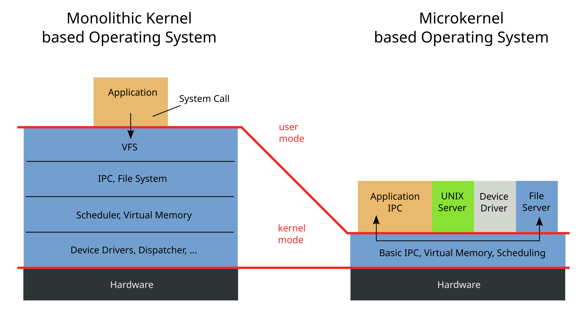

# Computer Fundamentals

## CPU Cental processing unit

- ALU (arithmetic logic unit) : responsible for all arithmetic parts
- The logical unit is responsible for logical operation which return boolean value
- The Control Unit is responsible for sequence of information cpu will execute

## What is bus line ?

A computer bus is a communication system within a computer or between computers that transfers data between different components. The purpose of buses is to reduce the number of "pathways" needed for communication between the components, by carrying out all communications over a single data channel.

A bus is a set of physical connections (cables, circuits, etc.) that can be shared by multiple hardware components to communicate with one another. Memory and input/ output devices are connected to the Central Processing Unit through a group of lines called a bus.

### Type of buses

1. Address Bus

A collection of wires used to identify particular location in main memory is called Address Bus. Or in other words, the information used to describe the memory locations travels along the address bus.

- The address bus transports memory addresses which the processor wants to access in order to read or write data..
- The address bus is unidirectional.
- The size of address bus determines how many unique memory locations can be addressed.
- Example:
  - A system with 4-bit address bus can address 24 = 16 Bytes of memory.
  - A system with 16-bit address bus can address 216 = 64 KB of memory
  - A system with 20-bit address bus can address 220 = 1 MB of memory.

2. Data Bus

A collection of wires through which data is transmitted from one part of a computer to another is called Data Bus.

- Data Bus can be thought of as a highway on which data travels within a computer.
- The main objective of data bus is transfer of the data between microprocessor to input/ output devices or memory.
- The data bus transfers instructions coming from or going to the processor.
- The data bus is bidirectional because the data can flow in either direction from CPU to memory(or input/output device) or from memory to the CPU.
- The size (width) of bus determines how much data can be transmitted at one time.
- Example:
  - A 16-bit bus can transmit 16 bits of data at a time.
  - 32-bit bus can transmit 32 bits at a time.

3. Control Bus

The connections that carry control information between the CPU and other devices within the computer is called Control Bus.

- The main objective of control bus is all signals controller carried from processor to other hardware device.
- The control bus transports orders and synchonisation signal coming from the control unit and travelling to all other hardware components
- The Control bus is bidirectional because the data can flow in either direction from CPU to memory(or input/output device) or from memory to the CPU.
- it also transmits response signals from the hardware.
- Example:
  - This bus is used to indicate whether the CPU is reading from memory or writing to memory.

these buses also know as system bus

## 32bit vs 64bit processor

says about the amount of data from memory a cpu can access from the cpu register

## What is System Software?

System Software is the type of software that is the interface between application software and the system. Low-level languages are used to write the system software. System Software maintains the system resources and gives the path for application software to run. An important thing is that without system software, the system can not run. It is general-purpose software.

### Functions of System Software

- Memory Management
- Processor Management
- File Management
- Security
- Error-detecting Aids
- Scheduling

### Features of System Software

- System software is written in a low-level language.
- The size of the system Software is smaller.
- System software is complex to understand.
- System software is present near hardware components.

### Types of System Software

1. Operating System: Operating System is the main part of the Computer System. It has the responsibility of managing all the resources such as CPU, Printer, Hard Disk, etc. It also provides services to many other Computers Softwares. Examples of Operating Systems are Linux, Apple, macOS, Microsoft Windows, etc.

2. Language Processor: System Software converts Human-Readable Language into a Machine Language and it is done by Language Processor. It converts programs into instructions that are easily readable by Machines.

3. Device Driver: A Device Driver is a program or software that helps to perform its functions by controlling the device. You first have to install a driver for running the program.

## What is Application Software?

Application Software is the type of software that runs as per user request. It runs on the platform which is provided by system software. High-level languages are used to write the application software. It’s a specific purpose software. The main difference between System Software and Application Software is that without system software, the system can not run on the other hand without application software, the Low-level maintenance system always runs.

### Functions of Application Software

- Information and data management
- Management of documents (document exchange systems)
- Development of visuals and video
- Emails, text messaging, audio, and video conferencing, and cooperation are all options.
- Management of accounting, finance, and payroll
- Management of resources (ERP and CRM systems)

### Features of Application Software

- Application software is written in a high-level language.
- Application software requires more storage space than system software.
- Only a single task is performed by each application software.
- Application Software is easy to build in comparison to system software.

### Types of Application Software

1. General Purpose Software: This Application Software is used to perform tasks that are used for a variety of tasks, just not limited to a specific task only. For Example, MS Word, MS Excel, etc.

2. Customized Software: It is used to perform tasks that are designed for specific organizations. For Example, Railway Reservation System, Airline Reservation System, etc.

3. Utility Software: It is used to support the architecture of the Computer. It is designed for optimizing and maintaining the system and also taking care of its requirements

## Kernel

A kernel is a central component of an operating system that manages the operations of computers and hardware. It basically manages operations of memory and CPU time. It is a core component of an operating system. Kernel acts as a bridge between applications and data processing performed at the hardware level using inter-process communication and system calls.

### What is Kernel?

A kernel is the core part of an operating system. It acts as a bridge between software applications and the hardware of a computer. The kernel manages system resources, such as the CPU, memory, and devices, ensuring everything works together smoothly and efficiently. It handles tasks like running programs, accessing files, and connecting to devices like printers and keyboards.

### Types of Kernel

The kernel manages the system’s resources and facilitates communication between hardware and software components. These kernels are of different types let’s discuss each type along with its advantages and disadvantages:

1. Monolithic Kernel

It is one of the types of kernel where all operating system services operate in kernel space. It has dependencies between systems components. It has huge lines of code which is complex.

- Example:

  - Unix, Linux, Open VMS, XTS-400 etc.

- Advantages

  - Efficiency: Monolithic kernels are generally faster than other types of kernels because they don’t have to switch between user and kernel modes for every system call, which can cause overhead.

  - Tight Integration: Since all the operating system services are running in kernel space, they can communicate more efficiently with each other, making it easier to implement complex functionalities and optimizations.

  - Simplicity: Monolithic kernels are simpler to design, implement, and debug than other types of kernels because they have a unified structure that makes it easier to manage the code.
    Lower latency: Monolithic kernels have lower latency than other types of kernels because system calls and interrupts can be handled directly by the kernel.

- Disadvantages

  - Stability Issues: Monolithic kernels can be less stable than other types of kernels because any bug or security vulnerability in a kernel service can affect the entire system.

  - Security Vulnerabilities: Since all the operating system services are running in kernel space, any security vulnerability in one of the services can compromise the entire system.

  - Maintenance Difficulties: Monolithic kernels can be more difficult to maintain than other types of kernels because any change in one of the services can affect the entire system.

  - Limited Modularity: Monolithic kernels are less modular than other types of kernels because all the operating system services are tightly integrated into the kernel space. This makes it harder to add or remove functionality without affecting the entire system.

2. Micro Kernel

It is kernel types which has minimalist approach. It has virtual memory and thread scheduling. It is more stable with less services in kernel space. It puts rest in user space. It is use in small os.

- Example :
  - Mach, L4, AmigaOS, Minix, K42 etc.
- Advantages

  - Reliability: Microkernel architecture is designed to be more reliable than monolithic kernels. Since most of the operating system services run outside the kernel space, any bug or security vulnerability in a service won’t affect the entire system.

  - Flexibility : Microkernel architecture is more flexible than monolithic kernels because it allows different operating system services to be added or removed without affecting the entire system.

  - Modularity: Microkernel architecture is more modular than monolithic kernels because each operating system service runs independently of the others. This makes it easier to maintain and debug the system.

  - Portability: Microkernel architecture is more portable than monolithic kernels because most of the operating system services run outside the kernel space. This makes it easier to port the operating system to different hardware architectures.

- Disadvantages

  - Performance: Microkernel architecture can be slower than monolithic kernels because it requires more context switches between user space and kernel space.

  - Complexity: Microkernel architecture can be more complex than monolithic kernels because it requires more communication and synchronization mechanisms between the different operating system services.

  - Development Difficulty: Developing operating systems based on microkernel architecture can be more difficult than developing monolithic kernels because it requires more attention to detail in designing the communication and synchronization mechanisms between the different services.

  - Higher Resource Usage: Microkernel architecture can use more system resources, such as memory and CPU, than monolithic kernels because it requires more communication and synchronization mechanisms between the different operating system services.



3. Hybrid Kernel

It is the combination of both monolithic kernel and microkernel. It has speed and design of monolithic kernel and modularity and stability of microkernel.

- Example :

  - Windows NT, Netware, BeOS etc.

- Advantages

  - Performance: Hybrid kernels can offer better performance than microkernels because they reduce the number of context switches required between user space and kernel space.

  - Reliability: Hybrid kernels can offer better reliability than monolithic kernels because they isolate drivers and other kernel components in separate protection domains.

  - Flexibility: Hybrid kernels can offer better flexibility than monolithic kernels because they allow different operating system services to be added or removed without affecting the entire system.

  - Compatibility: Hybrid kernels can be more compatible than microkernels because they can support a wider range of device drivers.

- Disadvantages

  - Complexity: Hybrid kernels can be more complex than monolithic kernels because they include both monolithic and microkernel components, which can make the design and implementation more difficult.

  - Security: Hybrid kernels can be less secure than microkernels because they have a larger attack surface due to the inclusion of monolithic components.

  - Maintenance: Hybrid kernels can be more difficult to maintain than microkernels because they have a more complex design and implementation.

  - Resource Usage: Hybrid kernels can use more system resources than microkernels because they include both monolithic and microkernel components.

### Functions of Kernel

The kernel is responsible for various critical functions that ensure the smooth operation of the computer system. These functions include:

1. Process Management
   - Scheduling and execution of processes.
   - Context switching between processes.
   - Process creation and termination.
2. Memory Management
   - Allocation and deallocation of memory space.
   - Managing virtual memory.
   - Handling memory protection and sharing.
3. Device Management
   - Managing input/output devices.
   - Providing a unified interface for hardware devices.
   - Handling device driver communication.
4. File System Management
   - Managing file operations and storage.
   - Handling file system mounting and unmounting.
   - Providing a file system interface to applications.
5. Resource Management
   - Managing system resources (CPU time, disk space, network bandwidth)
   - Allocating and deallocating resources as needed
   - Monitoring resource usage and enforcing resource limits
6. Security and Access Control
   - Enforcing access control policies.
   - Managing user permissions and authentication.
   - Ensuring system security and integrity.
7. Inter-Process Communication
   - Facilitating communication between processes.
   - Providing mechanisms like message passing and shared memory.

### Working of Kernel

- A kernel loads first into memory when an operating system is loaded and remains in memory until the operating system is shut down again. It is responsible for various tasks such as disk management , task management, and memory management .
- The kernel has a process table that keeps track of all active processes
- The process table contains a per-process region table whose entry points to entries in the region table.
- The kernel loads an executable file into memory during the ‘exec’ system call’.
- It decides which process should be allocated to the processor to execute and which process should be kept in the main memory to execute. It basically acts as an interface between user applications and hardware. The major aim of the kernel is to manage communication between software i.e. user-level applications and hardware i.e., CPU and disk memory.

### Objectives of Kernel

- To establish communication between user-level applications and hardware.
- To decide the state of incoming processes.
- To control disk management.
- To control memory management.
- To control task management.

## User Mode vs. Kernel Mode

In modern operating systems, software runs in two distinct modes: user mode and kernel mode. These modes are designed to protect the system's integrity and ensure efficient resource allocation.

### User Mode

- **Restricted Access:** Software running in user mode has limited access to system resources. This restriction prevents applications from directly accessing hardware or critical system components.
- **Process Isolation:** Each process in user mode operates within its own isolated memory space, preventing one process from interfering with another.
- **System Calls:** To access system resources or perform privileged operations, user-mode applications must make system calls. These system calls transition the process from user mode to kernel mode.

**Kernel Mode**

- **Privileged Access:** Software running in kernel mode has unrestricted access to system resources, including hardware and memory. This allows the kernel to manage and control all aspects of the system.
- **Single Address Space:** All kernel-mode processes share a single virtual address space, enabling them to communicate and coordinate directly.
- **High-Level Control:** The kernel is responsible for managing system resources, scheduling processes, handling interrupts, and enforcing security policies.

**Why the Separation?**

- **Security:** By restricting user-mode applications, the system can protect itself from malicious or accidental damage.
- **Efficiency:** The kernel can optimize resource allocation and scheduling, ensuring that critical system functions are not interrupted by user-mode processes.
- **Reliability:** If a user-mode application crashes, it will not affect the entire system, as the kernel remains in control.

**In essence, user mode and kernel mode provide a layered security model that balances the needs of user applications with the system's overall stability and security.**

Let's delve deeper into the concept of system calls, a crucial mechanism that bridges the gap between user mode and kernel mode.

## System Calls

A system call is a programmatic way for a user-mode process to request a service from the kernel. When a user-mode application needs to access a system resource or perform a privileged operation, it invokes a system call. This causes a transition from user mode to kernel mode, allowing the kernel to handle the request.

**The System Call Process:**

1. **User-Mode Application:** The application makes a system call, which is typically implemented as a function or instruction.
2. **Mode Switch:** The CPU switches from user mode to kernel mode. This involves saving the current user-mode context (registers, program counter, etc.) and loading the kernel's context.
3. **Kernel Handling:** The kernel takes control and processes the system call request. This may involve:
   - Allocating or deallocating memory
   - Reading or writing to a file
   - Creating or deleting a process
   - Sending or receiving network data
4. **Kernel Processing:** The kernel executes the necessary operations, which may involve interacting with hardware devices or other system components.
5. **Return to User Mode:** Once the kernel has completed the requested operation, it returns control to the user-mode application. The CPU switches back to user mode, restoring the application's context.

**Key Points About System Calls:**

- **Efficiency:** System calls are designed to be efficient, as they are optimized for frequent use.
- **Security:** By restricting direct access to system resources, system calls help maintain system security.
- **Abstraction:** System calls provide a level of abstraction, allowing user-mode applications to interact with the kernel without needing to know the underlying hardware details.
- **Portability:** System calls can be implemented in a way that is portable across different hardware platforms.

**Example of a System Call:**

Consider a simple example of a user-mode application that wants to read data from a file. The application would make a `read` system call, passing the kernel the file descriptor, buffer address, and number of bytes to read. The kernel would then perform the actual read operation, copying the data from the file into the specified buffer, and returning the number of bytes read to the application.

By understanding the concept of system calls, you can appreciate the intricate interplay between user-mode applications and the kernel, and how this mechanism ensures the efficient and secure operation of modern operating systems.

# Linux Fundamentals

## Commands

- echo : Output any text we provide
- whoami : Find out which user currently login
- find :
  `find -name filename `,
  `find -name *.filetype`,
- `wc -l access.log` : use to count number of lines
- `grep` is use to search content of file:
  `grep "192.169.0.0" access.log`

<table class="table table-bordered"><tbody><tr><td>Symbol / Operator</td><td>Description</td></tr><tr><td>&amp;</td><td>This operator allows you to run commands in the background of your terminal.</td></tr><tr><td>&amp;&amp;</td><td>This operator allows you to combine multiple commands together in one line of your terminal.</td></tr><tr><td>&gt;</td><td>This operator is a redirector - meaning that we can take the output from a command (such as using cat to output a file) and direct it elsewhere.</td></tr><tr><td>&gt;&gt;</td><td><p>This operator does the same function of the <code>&gt;</code> operator but appends the output rather than replacing (meaning nothing is overwritten).</p></td></tr></tbody></table>

# What is a Bootloader?

A bootloader, also known as a boot program or bootstrap loader, is a small computer program that initiates the boot process of a computer or embedded device. It's essentially the first piece of software that runs when you turn on your device.

**Key Functions of a Bootloader:**

1. **Power-On Self-Test (POST):** The bootloader performs a series of checks to ensure the hardware is functioning correctly. This includes verifying memory, CPU, and peripheral devices.
2. **Initialization:** It initializes the system's hardware components, such as the CPU, memory, and I/O devices.
3. **Loading the Operating System (OS):** The bootloader loads the operating system kernel from storage (usually a hard drive or SSD) into memory.
4. **Transferring Control:** Once the kernel is loaded, the bootloader transfers control to it, allowing the OS to take over and start the boot process.

**Types of Bootloaders:**

1. **Primary Bootloader:** This is the first bootloader that runs after the system is powered on. It's often stored in firmware (like BIOS or UEFI) or on a bootable device.
2. **Secondary Bootloader:** This bootloader is loaded by the primary bootloader and provides more advanced features, such as loading multiple operating systems or configuring boot options. Examples include GRUB, LILO, and Windows Boot Manager.

**Bootloader Diagram**

[Image of a bootloader diagram showing the steps from power-on to the OS loading]

**Importance of Bootloaders**

- **Essential for System Startup:** Without a bootloader, your computer wouldn't know how to start up and load the operating system.
- **Security:** Some bootloaders offer security features like secure boot, which helps prevent unauthorized software from loading.
- **Flexibility:** Bootloaders can provide options for selecting different boot devices or operating systems.

**Common Bootloader Examples:**

- **BIOS (Basic Input/Output System):** An older type of firmware that initializes hardware and loads the primary bootloader.
- **UEFI (Unified Extensible Firmware Interface):** A more modern firmware interface that offers faster boot times and advanced features.
- **GRUB (GRand Unified Bootloader):** A popular open-source bootloader that allows you to choose between multiple operating systems.
- **Windows Boot Manager:** The bootloader used in Windows operating systems.

# Linux Filesystem

 <table class="table table-striped text-left">
<thead>
<tr>
<th><strong>Path</strong></th>
<th><strong>Description</strong></th>
</tr>
</thead>
<tbody>
<tr>
<td><code>/</code></td>
<td>The top-level directory is the root filesystem and contains all of the files required to boot the operating system before other filesystems are mounted, as well as the files required to boot the other filesystems. After boot, all of the other filesystems are mounted at standard mount points as subdirectories of the root.</td>
</tr>
<tr>
<td><code>/bin</code></td>
<td>Contains essential command binaries.</td>
</tr>
<tr>
<td><code>/boot</code></td>
<td>Consists of the static bootloader, kernel executable, and files required to boot the Linux OS.</td>
</tr>
<tr>
<td><code>/dev</code></td>
<td>Contains device files to facilitate access to every hardware device attached to the system.</td>
</tr>
<tr>
<td><code>/etc</code></td>
<td>Local system configuration files. Configuration files for installed applications may be saved here as well.</td>
</tr>
<tr>
<td><code>/home</code></td>
<td>Each user on the system has a subdirectory here for storage.</td>
</tr>
<tr>
<td><code>/lib</code></td>
<td>Shared library files that are required for system boot.</td>
</tr>
<tr>
<td><code>/media</code></td>
<td>External removable media devices such as USB drives are mounted here.</td>
</tr>
<tr>
<td><code>/mnt</code></td>
<td>Temporary mount point for regular filesystems.</td>
</tr>
<tr>
<td><code>/opt</code></td>
<td>Optional files such as third-party tools can be saved here.</td>
</tr>
<tr>
<td><code>/root</code></td>
<td>The home directory for the root user.</td>
</tr>
<tr>
<td><code>/sbin</code></td>
<td>This directory contains executables used for system administration (binary system files).</td>
</tr>
<tr>
<td><code>/tmp</code></td>
<td>The operating system and many programs use this directory to store temporary files. This directory is generally cleared upon system boot and may be deleted at other times without any warning.</td>
</tr>
<tr>
<td><code>/usr</code></td>
<td>Contains executables, libraries, man files, etc.</td>
</tr>
<tr>
<td><code>/var</code></td>
<td>This directory contains variable data files such as log files, email in-boxes, web application related files, cron files, and more.</td>
</tr>
</tbody>
</table>

# File Description

The file descriptor in Linux os is an indicator of connection maintained by the kernel to perform IO operations. In Windows based os it is called as file-handle. It is connection from the OS to perform IO operation

By default these three are descriptors in linux

1. Data Stream for Input

- STDIN - 0

2. Data Stream for output

- STDOUT - 1

3. Data Stream for Output that relates to error occurring

- STDERR - 2

- `>` to forward output
- `2>` to forward `STDERR`
- `1>` to forward `STDOUT`
- `<` to give input to something
- `>>` is use to append result since `>` will override the results
- `cat << EOF > stream.txt` we will use the cat command to read our streaming input through the stream and direct it to a file called "stream.txt."
- Another way to redirect STDOUT is to use pipes `(|)`.
- These are useful when we want to use the STDOUT from one program to be processed by another. One of the most commonly used tools is grep
- `find /etc/ -name *.conf 2>/dev/null | grep systemd`
- The redirections work, not only once. We can use the obtained results to redirect them to another program. For the next example, we will use the tool called wc, which should count the total number of obtained results.

# Regular expression

Regular expressions (RegEx) are an art of expression language to search for patterns in text and files. They can be used to find and replace text, analyze data, validate input, perform searches, and more. In simple terms, they are a filter criterion that can be used to analyze and manipulate strings. They are available in various programming languages and programs and are used in many different ways and functions.

A regular expression is a sequence of letters and symbols that form a search pattern. In addition, regular expressions can be created with patterns called metacharacters. Meta characters are symbols that define the search pattern but have no literal meaning. We can use it in tools like grep or sed or others. Often regex is implemented in web applications for the validation of user input.

<table class="table table-striped text-left">
<thead>
<tr>
<th></th>
<th><strong>Operators</strong></th>
<th><strong>Description</strong></th>
</tr>
</thead>
<tbody>
<tr>
<td>1</td>
<td><code>(a)</code></td>
<td>The round brackets are used to group parts of a regex. Within the brackets, you can define further patterns which should be processed together.</td>
</tr>
<tr>
<td>2</td>
<td><code>[a-z]</code></td>
<td>The square brackets are used to define character classes. Inside the brackets, you can specify a list of characters to search for.</td>
</tr>
<tr>
<td>3</td>
<td><code>{1,10}</code></td>
<td>The curly brackets are used to define quantifiers. Inside the brackets, you can specify a number or a range that indicates how often a previous pattern should be repeated.</td>
</tr>
<tr>
<td>4</td>
<td><code>|</code></td>
<td>Also called the OR operator and shows results when one of the two expressions matches</td>
</tr>
<tr>
<td>5</td>
<td><code>.*</code></td>
<td>Also called the AND operator and displayed results only if both expressions match</td>
</tr>
</tbody>
</table>

# Permission Management

Under Linux, permissions are assigned to users and groups. Each user can be a member of different groups, and membership in these groups gives the user specific, additional permissions. Each file and directory belongs to a specific user and a specific group. So the permissions for users and groups that defined a file are also defined for the respective owners. When we create new files or directories, they belong to the group we belong to and us.

When a user wants to access the contents of a Linux directory, they must first traverse the directory, which means navigating to that directory, requiring the user to have execute permissions on the directory. Without this permission, the user cannot access the directory's contents and will instead be presented with a “Permission Denied" error message.

It is important to note that execute permissions are necessary to traverse a directory, no matter the user's level of access. Also, execute permissions on a directory do not allow a user to execute or modify any files or contents within the directory, only to traverse and access the content of the directory.

To execute files within the directory, a user needs execute permissions on the corresponding file. To modify the contents of a directory (create, delete, or rename files and subdirectories), the user needs write permissions on the directory.

The permissions can be set for the owner, group, and others like presented in the next example with their corresponding permissions.

```bash
- rwx rw- r--   1 root root 1641 May  4 23:42 /etc/passwd
- --- --- ---   |  |    |    |   |__________|
|  |   |   |    |  |    |    |        |_ Date
|  |   |   |    |  |    |    |__________ File Size
|  |   |   |    |  |    |_______________ Group
|  |   |   |    |  |____________________ User
|  |   |   |    |_______________________ Number of hard links
|  |   |   |_ Permission of others (read)
|  |   |_____ Permissions of the group (read, write)
|  |_________ Permissions of the owner (read, write, execute)
|____________ File type (- = File, d = Directory, l = Link, ... )
```

# Change Permission

We can modify permissions using the `chmod` command, permission group references (`u` - owner, `g` - Group, `o` - others, `a` - All users), and either `a` [+] or `a` [-] to add remove the designated permissions. In the following example, let us assume we have a file called shell and we want to change permissions for it so this script os owned by that user, becomes not executable, and set with read/write permissions for all users.

## Examples

- `chmod a+r shell && ls -l shell` a stands for all user
- `chmod 754 shell && ls -l shell` user,group,other uses octal values

# Change Owner

- To change the owner and/or the group assignments of a file or directory, we can use the chown command.
- `chown <user>:<group> <file/directory>`

# Sticky bits

Sticky bits are a type of file permission in Linux that can be set on directories. This type of permission provides an extra layer of security when controlling the deletion and renaming of files within a directory. It is typically used on directories that are shared by multiple users to prevent one user from accidentally deleting or renaming files that are important to others.

For example, in a shared home directory, where multiple users have access to the same directory, a system administrator can set the sticky bit on the directory to ensure that only the owner of the file, the owner of the directory, or the root user can delete or rename files within the directory. This means that other users cannot delete or rename files within the directory as they do not have the required permissions. This provides an added layer of security to protect important files, as only those with the necessary access can delete or rename files. Setting the sticky bit on a directory ensures that only the owner, the directory owner, or the root user can change the files within the directory.

When a sticky bit is set on a directory, it is represented by the letter “t" in the execute permission of the directory's permissions. For example, if a directory has permissions “rwxrwxrwt", it means that the sticky bit is set, giving the extra level of security so that no one other than the owner or root user can delete or rename the files or folders in the directory.

# User Management

User management is an essential part of Linux administration. Sometimes we need to create new users or add other users to specific groups. Another possibility is to execute commands as a different user. After all, it is not too rare that users of only one specific group have the permissions to view or edit specific files or directories. This, in turn, allows us to collect more information locally on the machine, which can be very important.

- `useradd` Create new users or update default new user information
- `userdel` Delete user account and related file
- `usermod` Modify the user account
- `addgroup` add group in system
- `delgroup` delete group
- `passwd` change the user password

# Package Management

<table class="table table-striped text-left">
<thead>
<tr>
<th><strong>Command</strong></th>
<th><strong>Description</strong></th>
</tr>
</thead>
<tbody>
<tr>
<td><code>dpkg</code></td>
<td>The <code>dpkg</code> is a tool to install, build, remove, and manage Debian packages. The primary and more user-friendly front-end for <code>dpkg</code> is aptitude.</td>
</tr>
<tr>
<td><code>apt</code></td>
<td>Apt provides a high-level command-line interface for the package management system.</td>
</tr>
<tr>
<td><code>aptitude</code></td>
<td>Aptitude is an alternative to apt and is a high-level interface to the package manager.</td>
</tr>
<tr>
<td><code>snap</code></td>
<td>Install, configure, refresh, and remove snap packages. Snaps enable the secure distribution of the latest apps and utilities for the cloud, servers, desktops, and the internet of things.</td>
</tr>
<tr>
<td><code>gem</code></td>
<td>Gem is the front-end to RubyGems, the standard package manager for Ruby.</td>
</tr>
<tr>
<td><code>pip</code></td>
<td>Pip is a Python package installer recommended for installing Python packages that are not available in the Debian archive. It can work with version control repositories (currently only Git, Mercurial, and Bazaar repositories), logs output extensively, and prevents partial installs by downloading all requirements before starting installation.</td>
</tr>
<tr>
<td><code>git</code></td>
<td>Git is a fast, scalable, distributed revision control system with an unusually rich command set that provides both high-level operations and full access to internals.</td>
</tr>
</tbody>
</table>

# Service and process management

In general, there are two types of services: internal, the relevant services that are required at system startup, which for example, perform hardware-related tasks, and services that are installed by the user, which usually include all server services. Such services run in the background without any user interaction. These are also called daemons and are identified by the letter 'd' at the end of the program name, for example, sshd or systemd.

Most Linux distributions have now switched to systemd. This daemon is an Init process started first and thus has the process ID (PID) 1. This daemon monitors and takes care of the orderly starting and stopping of other services. All processes have an assigned PID that can be viewed under /proc/ with the corresponding number. Such a process can have a parent process ID (PPID), and if so, it is known as the child process.

Besides systemctl we can also use update-rc.d to manage SysV init script links.

- `systemctl start ssh` After installing OpenSSH on our VM, we can start the service with the following command.
- `systemctl status ssh`
- `systemctl enable ssh`
- `ps -aux` to list all the running process
- `systemctl list-units --type=service` list all the services

## Kill a Process

A process can be in the following states:

- Running
- Waiting (waiting for an event or system resource)
- Stopped
- Zombie (stopped but still has an entry in the process table).

Processes can be controlled using kill, pkill, pgrep, and killall. To interact with a process, we must send a signal to it.

`kill -l` will list all the signal

here are some commonly used one

<table class="table table-striped text-left">
<thead>
<tr>
<th><strong>Signal</strong></th>
<th><strong>Description</strong></th>
</tr>
</thead>
<tbody>
<tr>
<td><code>1</code></td>
<td><code>SIGHUP</code> - This is sent to a process when the terminal that controls it is closed.</td>
</tr>
<tr>
<td><code>2</code></td>
<td><code>SIGINT</code> - Sent when a user presses <code>[Ctrl] + C</code> in the controlling terminal to interrupt a process.</td>
</tr>
<tr>
<td><code>3</code></td>
<td><code>SIGQUIT</code> - Sent when a user presses <code>[Ctrl] + D</code> to quit.</td>
</tr>
<tr>
<td><code>9</code></td>
<td><code>SIGKILL</code> - Immediately kill a process with no clean-up operations.</td>
</tr>
<tr>
<td><code>15</code></td>
<td><code>SIGTERM</code> - Program termination.</td>
</tr>
<tr>
<td><code>19</code></td>
<td><code>SIGSTOP</code> - Stop the program. It cannot be handled anymore.</td>
</tr>
<tr>
<td><code>20</code></td>
<td><code>SIGTSTP</code> - Sent when a user presses <code>[Ctrl] + Z</code> to request for a service to suspend. The user can handle it afterward.</td>
</tr>
</tbody>
</table>

- `kill 9 <PID> `
- `ctrl + z` make all the running process in suspend state
- `jobs` will list background process
- `bg` to put process in background
- `&` can also use to make process background
- `fg` to make process foreground

## Execute Multiple commands

There are three possibilities to run several commands, one after the other. These are separated by:

- Semicolon (;)
  - The semicolon (;) is a command separator and executes the commands by ignoring previous commands' results and errors.
  - `echo '1'; echo '2'; echo '3'`
- Double ampersand characters (&&)
  - If there is an error in one of the commands, the following ones will not be executed anymore, and the whole process will be stopped.
- Pipes (|)
  - Pipes (|) depend not only on the correct and error-free operation of the previous processes but also on the previous processes

# Task Scheduling

Task scheduling is a feature in Linux systems that allows users to schedule and automate tasks. It allows administrators and users to run tasks at a specific time or within specific frequencies without having to start them manually. It can be used in Linux systems such as Ubuntu, Redhat Linux, and Solaris to manage a variety of tasks. Examples include automatically updating software, running scripts, cleaning databases, and automating backups. This also allows users to schedule regular and repetitive tasks to ensure they are run regularly. In addition, alerts can be set up to display when certain events occur or to contact administrators or users. There are many different use cases for automation of this type, but these cover most cases.

## Systemd

Systemd is a service used in Linux systems such as Ubuntu, Redhat Linux, and Solaris to start processes and scripts at a specific time. With it, we can set up processes and scripts to run at a specific time or time interval and can also specify specific events and triggers that will trigger a specific task. To do this, we need to take some steps and precautions before our scripts or processes are automatically executed by the system.

1. Create a timer
2. Create a service
3. Activate the timer

### Create a timer

```bash
sudo mkdir /etc/systemd/system/mytimer.timer.d
sudo vim /etc/systemd/system/mytimer.timer
```

Next, we need to create a script that configures the timer. The script must contain the following options: "Unit", "Timer" and "Install". The "Unit" option specifies a description for the timer. The "Timer" option specifies when to start the timer and when to activate it. Finally, the "Install" option specifies where to install the timer.

```text

[Unit]
Description=My Timer

[Timer]
OnBootSec=3min
OnUnitActiveSec=1hour

[Install]
WantedBy=timers.target
```

### Create the Service

```bash
sudo vim /etc/systemd/system/mytimer.service
```

Here we set a description and specify the full path to the script we want to run. The "multi-user.target" is the unit system that is activated when starting a normal multi-user mode. It defines the services that should be started on a normal system startup.

```
[Unit]
Description=My Service

[Service]
ExecStart=/full/path/to/my/script.sh

[Install]
WantedBy=multi-user.target
```

```bash
sudo systemctl daemon-reload
```

### Activate the timer

```bash
sudo systemctl start mytimer.service
sudo systemctl enable mytimer.service
```

## Cron

Cron is another tool that can be used in Linux systems to schedule and automate processes. It allows users and administrators to execute tasks at a specific time or within specific intervals. For the above examples, we can also use Cron to automate the same tasks. We just need to create a script and then tell the cron daemon to call it at a specific time.

With Cron, we can automate the same tasks, but the process for setting up the Cron daemon is a little different than Systemd. To set up the cron daemon, we need to store the tasks in a file called crontab and then tell the daemon when to run the tasks. Then we can schedule and automate the tasks by configuring the cron daemon accordingly.

```txt
(crontab)

# System Update
0 */6 * * /path/to/update_software.sh

# Execute scripts
0 0 1 * * /path/to/scripts/run_scripts.sh

# Cleanup DB
0 0 * * 0 /path/to/scripts/clean_database.sh

# Backups
0 0 * * 7 /path/to/scripts/backup.sh
```

The "System Update" should be executed once every sixth hour. This is indicated by the entry 0 \*/6 in the hour column. The task is executed by the script update_software.sh, whose path is given in the last column.

The task execute scripts is to be executed every first day of the month at midnight. This is indicated by the entries 0 and 0 in the minute and hour columns and 1 in the days-of-the-month column. The task is executed by the run_scripts.sh script, whose path is given in the last column.

The third task, Cleanup DB, is to be executed every Sunday at midnight. This is specified by the entries 0 and 0 in the minute and hour columns and 0 in the days-of-the-week column. The task is executed by the clean_database.sh script, whose path is given in the last column.

The fourth task, backups, is to be executed every Sunday at midnight. This is indicated by the entries 0 and 0 in the minute and hour columns and 7 in the days-of-the-week column. The task is executed by the backup.sh script, whose path is given in the last column.

# Network Service

## SSH

Secure Shell (SSH) is a network protocol that allows the secure transmission of data and commands over a network. It is widely used to securely manage remote systems and securely access remote systems to execute commands or transfer files. In order to connect to our or a remote Linux host via SSH, a corresponding SSH server must be available and running.

The most commonly used SSH server is the OpenSSH server. OpenSSH is a free and open-source implementation of the Secure Shell (SSH) protocol that allows the secure transmission of data and commands over a network.

Administrators use OpenSSH to securely manage remote systems by establishing an encrypted connection to a remote host. With OpenSSH, administrators can execute commands on remote systems, securely transfer files, and establish a secure remote connection without the transmission of data and commands being intercepted by third parties.

`sudo apt install openssh-server -y`

### ssh login

`ssh cry0l1t3@10.129.17.122`

OpenSSH can be configured and customized by editing the file /etc/ssh/sshd_config with a text editor. Here we can adjust settings such as the maximum number of concurrent connections, the use of passwords or keys for logins, host key checking, and more. However, it is important for us to note that changes to the OpenSSH configuration file must be done carefully.

## NFS

Network File System (NFS) is a network protocol that allows us to store and manage files on remote systems as if they were stored on the local system. It enables easy and efficient management of files across networks. For example, administrators use NFS to store and manage files centrally (for Linux and Windows systems) to enable easy collaboration and management of data. For Linux, there are several NFS servers, including NFS-UTILS (Ubuntu), NFS-Ganesha (Solaris), and OpenNFS (Redhat Linux).

It can also be used to share and manage resources efficiently, e.g., to replicate file systems between servers. It also offers features such as access controls, real-time file transfer, and support for multiple users accessing data simultaneously. We can use this service just like FTP in case there is no FTP client installed on the target system, or NFS is running instead of FTP.

`sudo apt install nfs-kernel-server -y`

We can configure NFS via the configuration file /etc/exports. This file specifies which directories should be shared and the access rights for users and systems. It is also possible to configure settings such as the transfer speed and the use of encryption. NFS access rights determine which users and systems can access the shared directories and what actions they can perform. Here are some important access rights that can be configured in NFS:

<table class="table table-striped text-left">
<thead>
<tr>
<th><strong>Permissions</strong></th>
<th><strong>Description</strong></th>
</tr>
</thead>
<tbody>
<tr>
<td><code>rw</code></td>
<td>Gives users and systems read and write permissions to the shared directory.</td>
</tr>
<tr>
<td><code>ro</code></td>
<td>Gives users and systems read-only access to the shared directory.</td>
</tr>
<tr>
<td><code>no_root_squash</code></td>
<td>Prevents the root user on the client from being restricted to the rights of a normal user.</td>
</tr>
<tr>
<td><code>root_squash</code></td>
<td>Restricts the rights of the root user on the client to the rights of a normal user.</td>
</tr>
<tr>
<td><code>sync</code></td>
<td>Synchronizes the transfer of data to ensure that changes are only transferred after they have been saved on the file system.</td>
</tr>
<tr>
<td><code>async</code></td>
<td>Transfers data asynchronously, which makes the transfer faster, but may cause inconsistencies in the file system if changes have not been fully committed.</td>
</tr>
</tbody>
</table>

### Create NFS Share

```bash
mkdir nfs_sharing
echo '/home/cry0l1t3/nfs_sharing hostname(rw,sync,no_root_squash)' >> /etc/exports
cat /etc/exports | grep -v "#"
```

### Mount NFS Share

```bash
mkdir ~/target_nfs
mount 10.129.12.17:/home/john/dev_scripts ~/target_nfs
tree ~/target_nfs
```

So we have mounted the NFS share (dev_scripts) from our target (10.129.12.17) locally to our system in the mount point target_nfs over the network and can view the contents just as if we were on the target system. There are even some methods that can be used in specific cases to escalate our privileges on the remote system using NFS.

# File and folders

everything in linux is file

- in `bin` folder we have all of our command binaries
- in `sbin` have the administration binaries
- `var` have log files
- `home` where all the user live
- `etc` have configuration files
- `media` and `mnt` have the external media attached to it
- `ps` for process status
- `su` for switch user
- `apropos` will help you to find command using keyword

# managing users in linux

- `username:x:userid:groupid:name:random:homedir:shell`
- `sudo passwd username` to change or set the password
- `usermod` to modify user
- `sudo usermod username --shell /bin/bash` to change the default shell
- `su - username` to change to other user
- `sudo userdel username` delete the user
- `sudo groupadd groupname` to create new group
- we should add group to sudors file
- `sudo visudo` to modify sudo file
- `usermod` can use to add user to specific group
- `groups` to view groups in system
- `ctrl + a` in terminal to get in front of line
- `sudo apt purge package_name` to remove package and userdata

# daemons

- `ps -aux` to get all the running process
- background running processes are called as daemons
- process end with d is daemon
- systemd is master daemon who controls all other daemons
- systemd have following works
  - Service management
  - system Initialization
- `pstree` generate teh process tree
- `systemctl` is use to control the daemons
- `systemctl stop service_name` to stop some service
- `systemctl status service_name` to get the status
- instead of `stop` we can also use `restart`
- `enable` or `disable` to change bootup call
- `systemctl list-units`
- `systemctl list-unit-files` to get all the daemon which is not mounted in ram
- `journalctl` stores the log of systemd

# kill linux process

- `ps -u user_name` will give all the process running for that user
- `kill process_id` to kill any process
- `pgrep` which is combination of ps and grep
- There are two type of processes

  - foreground
  - background

- `ctrl + z` to put process in sleep (will still foreground process)
- `jobs` will show all the background running process
- `bg job_id` to make job background
- `fg job_id` to make is foreground
- `&` to make any job background
- `kill -l` to get all the available signals
- `kill -id process_id` to use specific way to kill the process
- `pkill name` is same as grep , use to kill all the process
- `ctrl + e` to get end of command
- `ctrl + u` delete everything before cursor
- `ctrl + y` paste the deleted
- `ctrl + k` delete after the curson
- `ctrl + xe` to edit on spot
- `sudo !!` will run the previous command as sudo if not
