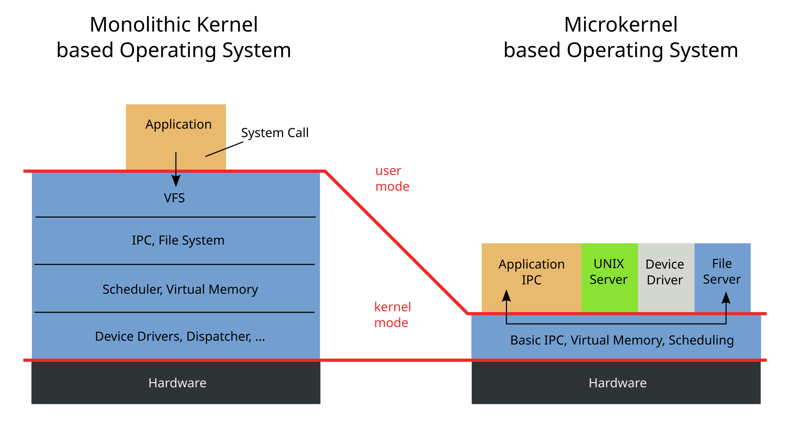

# Computer Fundamentals

## CPU Cental processing unit

- ALU (arithmetic logic unit) : responsible for all arithmetic parts
- The logical unit is responsible for logical operation which return boolean value
- The Control Unit is responsible for sequence of information cpu will execute

## What is bus line ?

A computer bus is a communication system within a computer or between computers that transfers data between different components. The purpose of buses is to reduce the number of "pathways" needed for communication between the components, by carrying out all communications over a single data channel.

A bus is a set of physical connections (cables, circuits, etc.) that can be shared by multiple hardware components to communicate with one another. Memory and input/ output devices are connected to the Central Processing Unit through a group of lines called a bus.

### Type of buses

1. Address Bus

A collection of wires used to identify particular location in main memory is called Address Bus. Or in other words, the information used to describe the memory locations travels along the address bus.

- The address bus transports memory addresses which the processor wants to access in order to read or write data..
- The address bus is unidirectional.
- The size of address bus determines how many unique memory locations can be addressed.
- Example:
  - A system with 4-bit address bus can address 24 = 16 Bytes of memory.
  - A system with 16-bit address bus can address 216 = 64 KB of memory
  - A system with 20-bit address bus can address 220 = 1 MB of memory.

2. Data Bus

A collection of wires through which data is transmitted from one part of a computer to another is called Data Bus.

- Data Bus can be thought of as a highway on which data travels within a computer.
- The main objective of data bus is transfer of the data between microprocessor to input/ output devices or memory.
- The data bus transfers instructions coming from or going to the processor.
- The data bus is bidirectional because the data can flow in either direction from CPU to memory(or input/output device) or from memory to the CPU.
- The size (width) of bus determines how much data can be transmitted at one time.
- Example:
  - A 16-bit bus can transmit 16 bits of data at a time.
  - 32-bit bus can transmit 32 bits at a time.

3. Control Bus

The connections that carry control information between the CPU and other devices within the computer is called Control Bus.

- The main objective of control bus is all signals controller carried from processor to other hardware device.
- The control bus transports orders and synchonisation signal coming from the control unit and travelling to all other hardware components
- The Control bus is bidirectional because the data can flow in either direction from CPU to memory(or input/output device) or from memory to the CPU.
- it also transmits response signals from the hardware.
- Example:
  - This bus is used to indicate whether the CPU is reading from memory or writing to memory.

these buses also know as system bus

## 32bit vs 64bit processor

says about the amount of data from memory a cpu can access from the cpu register

## What is System Software?

System Software is the type of software that is the interface between application software and the system. Low-level languages are used to write the system software. System Software maintains the system resources and gives the path for application software to run. An important thing is that without system software, the system can not run. It is general-purpose software.

### Functions of System Software

- Memory Management
- Processor Management
- File Management
- Security
- Error-detecting Aids
- Scheduling

### Features of System Software

- System software is written in a low-level language.
- The size of the system Software is smaller.
- System software is complex to understand.
- System software is present near hardware components.

### Types of System Software

1. Operating System: Operating System is the main part of the Computer System. It has the responsibility of managing all the resources such as CPU, Printer, Hard Disk, etc. It also provides services to many other Computers Softwares. Examples of Operating Systems are Linux, Apple, macOS, Microsoft Windows, etc.

2. Language Processor: System Software converts Human-Readable Language into a Machine Language and it is done by Language Processor. It converts programs into instructions that are easily readable by Machines.

3. Device Driver: A Device Driver is a program or software that helps to perform its functions by controlling the device. You first have to install a driver for running the program.

## What is Application Software?

Application Software is the type of software that runs as per user request. It runs on the platform which is provided by system software. High-level languages are used to write the application software. It’s a specific purpose software. The main difference between System Software and Application Software is that without system software, the system can not run on the other hand without application software, the Low-level maintenance system always runs.

### Functions of Application Software

- Information and data management
- Management of documents (document exchange systems)
- Development of visuals and video
- Emails, text messaging, audio, and video conferencing, and cooperation are all options.
- Management of accounting, finance, and payroll
- Management of resources (ERP and CRM systems)

### Features of Application Software

- Application software is written in a high-level language.
- Application software requires more storage space than system software.
- Only a single task is performed by each application software.
- Application Software is easy to build in comparison to system software.

### Types of Application Software

1. General Purpose Software: This Application Software is used to perform tasks that are used for a variety of tasks, just not limited to a specific task only. For Example, MS Word, MS Excel, etc.

2. Customized Software: It is used to perform tasks that are designed for specific organizations. For Example, Railway Reservation System, Airline Reservation System, etc.

3. Utility Software: It is used to support the architecture of the Computer. It is designed for optimizing and maintaining the system and also taking care of its requirements

## Kernel

A kernel is a central component of an operating system that manages the operations of computers and hardware. It basically manages operations of memory and CPU time. It is a core component of an operating system. Kernel acts as a bridge between applications and data processing performed at the hardware level using inter-process communication and system calls.

### What is Kernel?

A kernel is the core part of an operating system. It acts as a bridge between software applications and the hardware of a computer. The kernel manages system resources, such as the CPU, memory, and devices, ensuring everything works together smoothly and efficiently. It handles tasks like running programs, accessing files, and connecting to devices like printers and keyboards.

### Types of Kernel

The kernel manages the system’s resources and facilitates communication between hardware and software components. These kernels are of different types let’s discuss each type along with its advantages and disadvantages:

1. Monolithic Kernel

It is one of the types of kernel where all operating system services operate in kernel space. It has dependencies between systems components. It has huge lines of code which is complex.

- Example:

  - Unix, Linux, Open VMS, XTS-400 etc.

- Advantages

  - Efficiency: Monolithic kernels are generally faster than other types of kernels because they don’t have to switch between user and kernel modes for every system call, which can cause overhead.

  - Tight Integration: Since all the operating system services are running in kernel space, they can communicate more efficiently with each other, making it easier to implement complex functionalities and optimizations.

  - Simplicity: Monolithic kernels are simpler to design, implement, and debug than other types of kernels because they have a unified structure that makes it easier to manage the code.
    Lower latency: Monolithic kernels have lower latency than other types of kernels because system calls and interrupts can be handled directly by the kernel.

- Disadvantages

  - Stability Issues: Monolithic kernels can be less stable than other types of kernels because any bug or security vulnerability in a kernel service can affect the entire system.

  - Security Vulnerabilities: Since all the operating system services are running in kernel space, any security vulnerability in one of the services can compromise the entire system.

  - Maintenance Difficulties: Monolithic kernels can be more difficult to maintain than other types of kernels because any change in one of the services can affect the entire system.

  - Limited Modularity: Monolithic kernels are less modular than other types of kernels because all the operating system services are tightly integrated into the kernel space. This makes it harder to add or remove functionality without affecting the entire system.

2. Micro Kernel

It is kernel types which has minimalist approach. It has virtual memory and thread scheduling. It is more stable with less services in kernel space. It puts rest in user space. It is use in small os.

- Example :
  - Mach, L4, AmigaOS, Minix, K42 etc.
- Advantages

  - Reliability: Microkernel architecture is designed to be more reliable than monolithic kernels. Since most of the operating system services run outside the kernel space, any bug or security vulnerability in a service won’t affect the entire system.

  - Flexibility : Microkernel architecture is more flexible than monolithic kernels because it allows different operating system services to be added or removed without affecting the entire system.

  - Modularity: Microkernel architecture is more modular than monolithic kernels because each operating system service runs independently of the others. This makes it easier to maintain and debug the system.

  - Portability: Microkernel architecture is more portable than monolithic kernels because most of the operating system services run outside the kernel space. This makes it easier to port the operating system to different hardware architectures.

- Disadvantages

  - Performance: Microkernel architecture can be slower than monolithic kernels because it requires more context switches between user space and kernel space.

  - Complexity: Microkernel architecture can be more complex than monolithic kernels because it requires more communication and synchronization mechanisms between the different operating system services.

  - Development Difficulty: Developing operating systems based on microkernel architecture can be more difficult than developing monolithic kernels because it requires more attention to detail in designing the communication and synchronization mechanisms between the different services.

  - Higher Resource Usage: Microkernel architecture can use more system resources, such as memory and CPU, than monolithic kernels because it requires more communication and synchronization mechanisms between the different operating system services.

3. Hybrid Kernel

It is the combination of both monolithic kernel and microkernel. It has speed and design of monolithic kernel and modularity and stability of microkernel.

- Example :

  - Windows NT, Netware, BeOS etc.

- Advantages

  - Performance: Hybrid kernels can offer better performance than microkernels because they reduce the number of context switches required between user space and kernel space.

  - Reliability: Hybrid kernels can offer better reliability than monolithic kernels because they isolate drivers and other kernel components in separate protection domains.

  - Flexibility: Hybrid kernels can offer better flexibility than monolithic kernels because they allow different operating system services to be added or removed without affecting the entire system.

  - Compatibility: Hybrid kernels can be more compatible than microkernels because they can support a wider range of device drivers.

- Disadvantages

  - Complexity: Hybrid kernels can be more complex than monolithic kernels because they include both monolithic and microkernel components, which can make the design and implementation more difficult.

  - Security: Hybrid kernels can be less secure than microkernels because they have a larger attack surface due to the inclusion of monolithic components.

  - Maintenance: Hybrid kernels can be more difficult to maintain than microkernels because they have a more complex design and implementation.

  - Resource Usage: Hybrid kernels can use more system resources than microkernels because they include both monolithic and microkernel components.

### Functions of Kernel

The kernel is responsible for various critical functions that ensure the smooth operation of the computer system. These functions include:

1. Process Management
   - Scheduling and execution of processes.
   - Context switching between processes.
   - Process creation and termination.
2. Memory Management
   - Allocation and deallocation of memory space.
   - Managing virtual memory.
   - Handling memory protection and sharing.
3. Device Management
   - Managing input/output devices.
   - Providing a unified interface for hardware devices.
   - Handling device driver communication.
4. File System Management
   - Managing file operations and storage.
   - Handling file system mounting and unmounting.
   - Providing a file system interface to applications.
5. Resource Management
   - Managing system resources (CPU time, disk space, network bandwidth)
   - Allocating and deallocating resources as needed
   - Monitoring resource usage and enforcing resource limits
6. Security and Access Control
   - Enforcing access control policies.
   - Managing user permissions and authentication.
   - Ensuring system security and integrity.
7. Inter-Process Communication
   - Facilitating communication between processes.
   - Providing mechanisms like message passing and shared memory.

### Working of Kernel

- A kernel loads first into memory when an operating system is loaded and remains in memory until the operating system is shut down again. It is responsible for various tasks such as disk management , task management, and memory management .
- The kernel has a process table that keeps track of all active processes
- The process table contains a per-process region table whose entry points to entries in the region table.
- The kernel loads an executable file into memory during the ‘exec’ system call’.
- It decides which process should be allocated to the processor to execute and which process should be kept in the main memory to execute. It basically acts as an interface between user applications and hardware. The major aim of the kernel is to manage communication between software i.e. user-level applications and hardware i.e., CPU and disk memory.

### Objectives of Kernel

- To establish communication between user-level applications and hardware.
- To decide the state of incoming processes.
- To control disk management.
- To control memory management.
- To control task management.

## User Mode vs. Kernel Mode

In modern operating systems, software runs in two distinct modes: user mode and kernel mode. These modes are designed to protect the system's integrity and ensure efficient resource allocation.

### User Mode

- **Restricted Access:** Software running in user mode has limited access to system resources. This restriction prevents applications from directly accessing hardware or critical system components.
- **Process Isolation:** Each process in user mode operates within its own isolated memory space, preventing one process from interfering with another.
- **System Calls:** To access system resources or perform privileged operations, user-mode applications must make system calls. These system calls transition the process from user mode to kernel mode.

**Kernel Mode**

- **Privileged Access:** Software running in kernel mode has unrestricted access to system resources, including hardware and memory. This allows the kernel to manage and control all aspects of the system.
- **Single Address Space:** All kernel-mode processes share a single virtual address space, enabling them to communicate and coordinate directly.
- **High-Level Control:** The kernel is responsible for managing system resources, scheduling processes, handling interrupts, and enforcing security policies.

**Why the Separation?**

- **Security:** By restricting user-mode applications, the system can protect itself from malicious or accidental damage.
- **Efficiency:** The kernel can optimize resource allocation and scheduling, ensuring that critical system functions are not interrupted by user-mode processes.
- **Reliability:** If a user-mode application crashes, it will not affect the entire system, as the kernel remains in control.

**In essence, user mode and kernel mode provide a layered security model that balances the needs of user applications with the system's overall stability and security.**

Let's delve deeper into the concept of system calls, a crucial mechanism that bridges the gap between user mode and kernel mode.

## System Calls

A system call is a programmatic way for a user-mode process to request a service from the kernel. When a user-mode application needs to access a system resource or perform a privileged operation, it invokes a system call. This causes a transition from user mode to kernel mode, allowing the kernel to handle the request.

**The System Call Process:**

1. **User-Mode Application:** The application makes a system call, which is typically implemented as a function or instruction.
2. **Mode Switch:** The CPU switches from user mode to kernel mode. This involves saving the current user-mode context (registers, program counter, etc.) and loading the kernel's context.
3. **Kernel Handling:** The kernel takes control and processes the system call request. This may involve:
   - Allocating or deallocating memory
   - Reading or writing to a file
   - Creating or deleting a process
   - Sending or receiving network data
4. **Kernel Processing:** The kernel executes the necessary operations, which may involve interacting with hardware devices or other system components.
5. **Return to User Mode:** Once the kernel has completed the requested operation, it returns control to the user-mode application. The CPU switches back to user mode, restoring the application's context.

**Key Points About System Calls:**

- **Efficiency:** System calls are designed to be efficient, as they are optimized for frequent use.
- **Security:** By restricting direct access to system resources, system calls help maintain system security.
- **Abstraction:** System calls provide a level of abstraction, allowing user-mode applications to interact with the kernel without needing to know the underlying hardware details.
- **Portability:** System calls can be implemented in a way that is portable across different hardware platforms.

**Example of a System Call:**

Consider a simple example of a user-mode application that wants to read data from a file. The application would make a `read` system call, passing the kernel the file descriptor, buffer address, and number of bytes to read. The kernel would then perform the actual read operation, copying the data from the file into the specified buffer, and returning the number of bytes read to the application.

By understanding the concept of system calls, you can appreciate the intricate interplay between user-mode applications and the kernel, and how this mechanism ensures the efficient and secure operation of modern operating systems.

# Linux Fundamentals

## Commands

- echo : Output any text we provide
- whoami : Find out which user currently login
- find :
  `find -name filename `,
  `find -name *.filetype`,
- `wc -l access.log` : use to count number of lines
- `grep` is use to search content of file:
  `grep "192.169.0.0" access.log`

<table class="table table-bordered"><tbody><tr><td>Symbol / Operator</td><td>Description</td></tr><tr><td>&amp;</td><td>This operator allows you to run commands in the background of your terminal.</td></tr><tr><td>&amp;&amp;</td><td>This operator allows you to combine multiple commands together in one line of your terminal.</td></tr><tr><td>&gt;</td><td>This operator is a redirector - meaning that we can take the output from a command (such as using cat to output a file) and direct it elsewhere.</td></tr><tr><td>&gt;&gt;</td><td>
This operator does the same function of the <code>&gt;</code> operator but appends the output rather than replacing (meaning nothing is overwritten).
</td></tr></tbody></table>

# What is a Bootloader?

A bootloader, also known as a boot program or bootstrap loader, is a small computer program that initiates the boot process of a computer or embedded device. It's essentially the first piece of software that runs when you turn on your device.

**Key Functions of a Bootloader:**

1. **Power-On Self-Test (POST):** The bootloader performs a series of checks to ensure the hardware is functioning correctly. This includes verifying memory, CPU, and peripheral devices.
2. **Initialization:** It initializes the system's hardware components, such as the CPU, memory, and I/O devices.
3. **Loading the Operating System (OS):** The bootloader loads the operating system kernel from storage (usually a hard drive or SSD) into memory.
4. **Transferring Control:** Once the kernel is loaded, the bootloader transfers control to it, allowing the OS to take over and start the boot process.

**Types of Bootloaders:**

1. **Primary Bootloader:** This is the first bootloader that runs after the system is powered on. It's often stored in firmware (like BIOS or UEFI) or on a bootable device.
2. **Secondary Bootloader:** This bootloader is loaded by the primary bootloader and provides more advanced features, such as loading multiple operating systems or configuring boot options. Examples include GRUB, LILO, and Windows Boot Manager.

**Bootloader Diagram**

[Image of a bootloader diagram showing the steps from power-on to the OS loading]

**Importance of Bootloaders**

- **Essential for System Startup:** Without a bootloader, your computer wouldn't know how to start up and load the operating system.
- **Security:** Some bootloaders offer security features like secure boot, which helps prevent unauthorized software from loading.
- **Flexibility:** Bootloaders can provide options for selecting different boot devices or operating systems.

**Common Bootloader Examples:**

- **BIOS (Basic Input/Output System):** An older type of firmware that initializes hardware and loads the primary bootloader.
- **UEFI (Unified Extensible Firmware Interface):** A more modern firmware interface that offers faster boot times and advanced features.
- **GRUB (GRand Unified Bootloader):** A popular open-source bootloader that allows you to choose between multiple operating systems.
- **Windows Boot Manager:** The bootloader used in Windows operating systems.

# Linux Filesystem

 <table class="table table-striped text-left">
<thead>
<tr>
<th><strong>Path</strong></th>
<th><strong>Description</strong></th>
</tr>
</thead>
<tbody>
<tr>
<td><code>/</code></td>
<td>The top-level directory is the root filesystem and contains all of the files required to boot the operating system before other filesystems are mounted, as well as the files required to boot the other filesystems. After boot, all of the other filesystems are mounted at standard mount points as subdirectories of the root.</td>
</tr>
<tr>
<td><code>/bin</code></td>
<td>Contains essential command binaries.</td>
</tr>
<tr>
<td><code>/boot</code></td>
<td>Consists of the static bootloader, kernel executable, and files required to boot the Linux OS.</td>
</tr>
<tr>
<td><code>/dev</code></td>
<td>Contains device files to facilitate access to every hardware device attached to the system.</td>
</tr>
<tr>
<td><code>/etc</code></td>
<td>Local system configuration files. Configuration files for installed applications may be saved here as well.</td>
</tr>
<tr>
<td><code>/home</code></td>
<td>Each user on the system has a subdirectory here for storage.</td>
</tr>
<tr>
<td><code>/lib</code></td>
<td>Shared library files that are required for system boot.</td>
</tr>
<tr>
<td><code>/media</code></td>
<td>External removable media devices such as USB drives are mounted here.</td>
</tr>
<tr>
<td><code>/mnt</code></td>
<td>Temporary mount point for regular filesystems.</td>
</tr>
<tr>
<td><code>/opt</code></td>
<td>Optional files such as third-party tools can be saved here.</td>
</tr>
<tr>
<td><code>/root</code></td>
<td>The home directory for the root user.</td>
</tr>
<tr>
<td><code>/sbin</code></td>
<td>This directory contains executables used for system administration (binary system files).</td>
</tr>
<tr>
<td><code>/tmp</code></td>
<td>The operating system and many programs use this directory to store temporary files. This directory is generally cleared upon system boot and may be deleted at other times without any warning.</td>
</tr>
<tr>
<td><code>/usr</code></td>
<td>Contains executables, libraries, man files, etc.</td>
</tr>
<tr>
<td><code>/var</code></td>
<td>This directory contains variable data files such as log files, email in-boxes, web application related files, cron files, and more.</td>
</tr>
</tbody>
</table>

