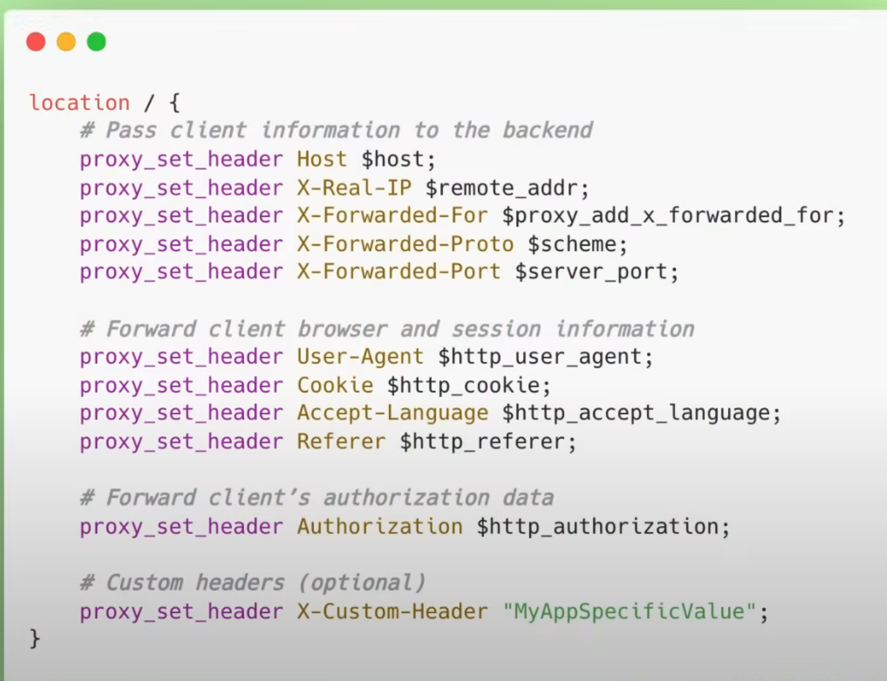

# Introduction

## What is proxy and reverse proxy

A proxy server, sometimes referred to as a forward proxy, is a server that routes traffic between client(s) and another system, usually external to the network. By doing so, it can regulate traffic according to preset policies, convert and mask client IP addresses, enforce security protocols, and block unknown traffic.

forward proxy act as gateway between client devices and network, primary purpose of forward proxy is to forward client request to webserver on behalf of client

What we can do? :

1. Authentication (only authorize client will allowed to access the internet)
2. Access Control (filter based on user permission or policies or limit access to certain resources)
3. logging
4. Identity masking
5. Cache Checks

Advantages:

1. Security: Help to hide the client identity
2. policies: white and black list certain content or websites
3. caches
4. Increases privacy
5. Content Filtering

Disadvantages:

1. Single Point of Failure
2. Reduce Performance
3. Encrypted Traffic can pose issue

A reverse proxy is a type of proxy server. Unlike a traditional proxy server, which is used to protect clients, a reverse proxy is used to protect servers. A reverse proxy is a server that accepts a request from a client, forwards the request to another one of many other servers, and returns the results from the server that actually processed the request to the client as if the proxy server had processed the request itself. The client only communicates directly with the reverse proxy server and it does not know that some other server actually processed its request.

UseCase:

1. Load Balancing
2. Filtering
3. Routing
4. Monitoring
5. Caching
6. Aggregating web apps (Reverse proxies are often used to aggregate multiple web applications under a single URL space, similarly to how API gateways consolidate and manage various API endpoints.)
7. Content Switching

Advantage:

1. Improve Performance
2. Balance Incoming load
3. Improve Security

Disadvantages:

4. Single Point Failure
5. Complex Setup

In config file there is two thing one is key value pairs called as directive and other is block which is called as context and each context has there own directives

## Function of Nginx

1. Load Balancing
2. Caching
3. (Security) One Entry Point
   - Having Single Point Entry significantly reduce the risk factor since we expose less attack area
   - Centralize access control
   - Minimize the exposure of architecture information
   - Centralize logging and monitoring
   - Encrypted Communication
4. Encrypted Communication
   - nginx can handle ssl / tsl encryption and decryption
   - We can configure nginx to only allow encrypted message
5. Nginx can compress the response
   - This will reduce the bandwidth consumption and improve load times
6. Nginx also support segmentation (sending response in chunk)

- The main config file is typically named "nginx.conf" and located in `etc/nginx` folder
- using syntax having `directive` and `Block`

## Serving Static Content

```config

http {
    types {
        text/css css;
        text/html html;
    }
    server {
        listen 8080;
        root path; //path should contain the index.html file in that folder
    }
}

events{

}
```

- reload the server : `nginx -s reload`

Adding all the allowed type is time consuming, so nginx already contain some mime types define in mime.types file

Limited Types

```config

http {
    types {
        text/css css;
        text/html html;
    }
    server {
        listen 8080;
        root path; //path should contain the index.html file in that folder
    }
}

events{

}
```

Use Already Provided

```config

http {
    include mime.types;
    server {
        listen 8080;
        root path; //path should contain the index.html file in that folder
    }
}

events{}
```

### Routes or Locations

```config

http {
    types {
        text/css css;
        text/html html;
    }
    server {
        listen 8080;
        root path; //path should contain the index.html file in that folder

        location /endpoint {
            root path; // endpoint folder should be there with index.html file
        }

        location /endpoint {
            alias path/different_endpoint_folder_name;
        }

        location /endpoint {
            root path;
            try_files /endpoint/xyz.html /index.html =404;
        }
        //Regular Expression
        location ~* /endpoint/[0-9] {
            root path;

        }
    }
}

events{

}
```

`root` will append the `/endpoint` to path but `alias` will not do that

### Redirect and Rewrite

```config

http {
    types {
        text/css css;
        text/html html;
    }
    server {
        listen 8080;
        root path; //path should contain the index.html file in that folder

        location /endpoint {
            root path; // endpoint folder should be there with index.html file
        }

        location /endpoint {
            alias path/different_endpoint_folder_name;
        }

        location /endpoint {
            root path;
            try_files /endpoint/xyz.html /index.html =404;
        }
        //Regular Expression
        location ~* /endpoint/[0-9] {
            root path;

        }
        // Below will change the url
        location /redirect_endpoint {
            return 307 /endpoint
        }

        rewrite ^/new_endpoint/(\w+) /endpoint/$1;

    }
}

events{

}
```

### Load Balancer

```config

http {
    types {
        text/css css;
        text/html html;
    }

    upstream some_name {
        server 127.0.0.1:1111
        server 127.0.0.1:2222
        server 127.0.0.1:3333
        server 127.0.0.1:4444
    }
    server {
        listen 8080;
        root path; //path should contain the index.html file in that folder

        location / {
            proxy_pass http://some_name/;
        }
    }
}

events{}
```

## Code

- proxy mean by doing some stuff on someone behalf
- By Exposing all the servers to public internet it will provide more surface area for attack so having nginx server will only expose one endpoint so it is hard for attacker to exploit

- `worker_processes` : Control how many parallel processes Nginx spawn to handle client request
  - Instead of using new process for every incoming connection, Nginx uses worker processes that handle many connection using single-thread event loop
  - Generally config it to number of core host cpu have

```
worker_processes auto;
or
worker_processes 1;
```

- `worker_connection` : how many simultaneous connection can be opened
  - if we have 1 worker_process we can handle 512 (default) clients
  - Higher number increases memory usage

```
events {
    worker_connection 1024;
}
```

- events: General connection processing
- http : HTTP traffic
- mail : mail traffic
- stream : TCP and UDP traffic

- `listen` ip address and host on which server will accept request
- `server` block inside the http
- `server_name` which domain and ip address this server block should respond
- `location` route
- `upstream` : refers to the servers that nginx forward request to
- `proxy_pass` : tells nginx to `pass` the request to another server

```
worker_processes 1;
events {
    worker_connection 1024;
}
http {
    include mime.types

    upstream any_name {
        server 127.0.0.1:3001;
        server 127.0.0.1:3002;
        server 127.0.0.1:3003;
    }

    server {
        listen 8000;
        server_name localhost;

        location / {
            proxy_pass http://any_name;
            proxy_set_header Host $host;
            proxy_set_header X-Real-IP $remote_addr;
        }
    }
}

```



```
worker_processes 1;
events {
    worker_connection 1024;
}
http {
    include mime.types

    upstream any_name {
        server 127.0.0.1:3001;
        server 127.0.0.1:3002;
        server 127.0.0.1:3003;
    }

    server {
        listen 443 ssl;
        server_name localhost;

        ssl_certificate: path;
        ssl_certificate_key: path;

        location / {
            proxy_pass http://any_name;
            proxy_set_header Host $host;
            proxy_set_header X-Real-IP $remote_addr;
        }
    }
}

```
