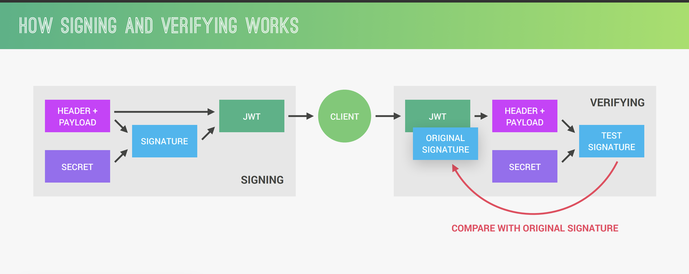

# Question ?

## synchronous vs asynchronous

- synchronous: synchronous function pauses the execution of the entire program until the operation it's performing is finished
- asynchronous: An asynchronous function doesn't wait for the operation to finish before continuing execution. It typically initiates the operation and then provides a mechanism (like callbacks or promises) to be notified when the operation completes.

2. Callback hell refers to a situation in Node.js where asynchronous code becomes difficult to read and maintain due to excessive nesting of callback functions.

## TCP/IP

TCP/IP, short for Transmission Control Protocol/Internet Protocol, is the foundation for communication on the internet. It's a suite of protocols that define how data is transmitted between devices on a network. Here's a breakdown of its key components:

**Function:**

TCP/IP ensures reliable data transmission by breaking down data into smaller packets, addressing them for delivery, and reassembling them at the receiving end. It also guarantees the order of packet delivery and checks for errors during transmission.

**Structure:**

TCP/IP consists of four layers, each with specific functionalities:

1. **Application Layer:** The topmost layer interacts with user applications like web browsers and email clients. It defines protocols like HTTP (Hypertext Transfer Protocol) for web communication and SMTP (Simple Mail Transfer Protocol) for emails.

2. **Transport Layer:** This layer is responsible for reliable data delivery between applications. It includes two main protocols:

   - **TCP (Transmission Control Protocol):** Guarantees in-order delivery of data packets and error checking.
   - **UDP (User Datagram Protocol):** Offers connectionless data transfer with lower overhead, suitable for real-time applications where order might not be critical (like streaming).

3. **Network Layer:** This layer handles routing data packets across networks. It uses the Internet Protocol (IP) to address and route packets based on their destination IP addresses.

4. **Link Layer:** The bottom layer interacts with the network interface card (NIC) for physical transmission of data packets over the network cable or wireless connection.

**Benefits of TCP/IP:**

- **Standardized:** TCP/IP is a universal protocol suite, allowing different devices and networks to communicate seamlessly.
- **Modular:** The layered structure enables independent development and improvement of each layer.
- **Reliable:** TCP ensures reliable data delivery with error checking and retransmission.
- **Flexible:** TCP/IP can accommodate different network types and traffic demands.

**Analogy:**

Imagine sending a large package across the country. TCP/IP acts like a reliable delivery service:

- **Application Layer:** You (the application) decide what to send (data).
- **Transport Layer:** The service packs your items securely (TCP) or loosely for faster delivery (UDP).
- **Network Layer:** The packages are labeled with destination addresses (IP addresses) and routed efficiently.
- **Link Layer:** The packages are physically transported by trucks or planes (network cables or Wi-Fi).

## NodeJS

**V8 Engine:**

- **Role:** The V8 engine is the heart of Node.js responsible for executing JavaScript code. It's derived from Chrome's JavaScript engine and is known for its efficiency in handling JavaScript code.
- **Functionality:**
  - Compiles JavaScript code into machine code for faster execution.
  - Manages memory allocation for JavaScript objects.
  - Performs garbage collection to reclaim unused memory.
  - Provides the environment for running JavaScript code, including data types, operators, and built-in functions.

**Libuv:**

- **Role:** Libuv is a cross-platform C library embedded within Node.js. It acts as the foundation for the event loop and provides efficient mechanisms for asynchronous I/O operations.
- **Functionality:**
  - Provides an event loop mechanism for handling incoming requests and managing asynchronous tasks.
  - Offers functions for various I/O operations, including file system access, network communication, timers, and process management.
  - Allows Node.js to remain non-blocking by providing callbacks to be notified when I/O operations complete.

**How they work together:**

1. **Request Arrival:** When a request arrives at the Node.js server, it's added to the event queue managed by libuv.
2. **Event Loop:** The single-threaded event loop continuously monitors the queue.
3. **JavaScript Code Execution:** When the event loop picks up a request, it extracts the associated JavaScript code.
4. **V8 Engine in Action:** The V8 engine takes over and parses the JavaScript code, compiling it into machine code for execution.
5. **Asynchronous Operations:** If the JavaScript code involves I/O operations, the V8 engine hands them off to libuv.
6. **Non-Blocking I/O:** Libuv initiates the I/O operations without blocking the event loop. It registers callbacks to be notified when the operations finish.
7. **Callback Execution:** When an I/O operation completes, libuv triggers the corresponding callback function.
8. **Back to V8 Engine:** The callback function is typically written in JavaScript and is executed by the V8 engine. This function can then process the results of the I/O operation and potentially make further asynchronous calls.
9. **Event Loop Continues:** The event loop remains active, continuously processing requests and I/O completions in a non-blocking manner.

**In summary, the V8 engine takes care of executing JavaScript code, while libuv handles the event loop and asynchronous I/O operations. This cooperative approach enables Node.js to achieve high performance and scalability by efficiently managing concurrent connections and I/O bound tasks.**

# What is Node JS ?

- nodejs is javascript runtime build on google open sourced v8 JS engine
- accessing the file system and networking capabilities comes with node js
- An event loop is a core mechanism in Node.js that allows it to handle multiple requests efficiently in a single thread. It's essentially a program that continuously monitors for events and executes callbacks when those events happen.
- Node js is single threaded and based on event driven, non-blocking I/O model thus it is fast and scalable
- use for building data intensive application server like data streaming app, real time chat app , server side app
- don't use node js for heavy server side rendering or processing alternative is php , python etc
- javascript for entire stack help for fast production
- npm huge library of open source packages available (node package manager)
- 'node filename' to run the file/script

## FILE READING

- we use fs module to read and write the code
- const fs = require('fs')
- in non blocking code callback function handle result of function
- having callback doesn't mean that it is async
- problem with callback is callback hell

```js
FILES;
const fs = require("fs");

// Blocking, synchronous way
const textIn = fs.readFileSync("./txt/input.txt", "utf-8");
console.log(textIn);
const textOut = `This is what we know about the avocado: ${textIn}.\nCreated on ${Date.now()}`;
fs.writeFileSync("./txt/output.txt", textOut);
console.log("File written!");

// Non-blocking, asynchronous way
fs.readFile("./txt/start.txt", "utf-8", (err, data1) => {
  if (err) return console.log("ERROR! 💥");

  fs.readFile(`./txt/${data1}.txt`, "utf-8", (err, data2) => {
    console.log(data2);
    fs.readFile("./txt/append.txt", "utf-8", (err, data3) => {
      console.log(data3);

      fs.writeFile("./txt/final.txt", `${data2}\n${data3}`, "utf-8", (err) => {
        console.log("Your file has been written 😁");
      });
    });
  });
});
console.log("Will read file!");
```

## NORMAL FUNCTION VS ARROW FUNCTION

- normal function have argument variable which is an local variable
- Arrow functions cannot be used as constructors
- Arrow functions cannot be accessed before initialization

```js
//NORMAL FUNCTION
function print() {
  console.log(arguments);
}

print("hello", 400, false);

// {
//   '0': 'hello',
//   '1': 400,
//   '2': false
// }
printName();

console.log("hello");

function printName() {
  console.log("i am dillion");
}

// i am dillion
// hello

// ARROW FUNCTION
const print = () => {
  console.log(arguments);
};

print("hello", 400, false);
// Uncaught ReferenceError: arguments is not defined
printName();

console.log("hello");

var printName = () => {
  console.log("i am dillion");
};

// TypeError: printName is not a function
```

## Simple WEB SERVER

- we use http module for sending http requests

```js
const http = require("http");
const server = http.createServer((req, res) => {
  res.end("Hello from server");
});
server.listen(port, host, () => {
  console.log("Server has start listening at port 8000");
});
```

- routing mean you get different response or resources depending on url

```js
const url = require('url')
...
console.log(req.url);
res.writeHead(404,{
  'content-type':'text/html'
  }) // will assign status code to response from server and can also add other headers

```

## NODE FARM

```js
const fs = require("fs");
const http = require("http");
const url = require("url");
const slugify = require("slugify");
const replaceTemplate = require("./modules/replaceTemplate");

const tempOverview = fs.readFileSync(
  `${__dirname}/templates/template-overview.html`,
  "utf-8"
);
const tempCard = fs.readFileSync(
  `${__dirname}/templates/template-card.html`,
  "utf-8"
);
const tempProduct = fs.readFileSync(
  `${__dirname}/templates/template-product.html`,
  "utf-8"
);

const data = fs.readFileSync(`${__dirname}/dev-data/data.json`, "utf-8");
const dataObj = JSON.parse(data);

const slugs = dataObj.map((el) => slugify(el.productName, { lower: true }));
console.log(slugs);

const server = http.createServer((req, res) => {
  const { query, pathname } = url.parse(req.url, true);

  // Overview page
  if (pathname === "/" || pathname === "/overview") {
    res.writeHead(200, {
      "Content-type": "text/html",
    });

    const cardsHtml = dataObj
      .map((el) => replaceTemplate(tempCard, el))
      .join("");
    const output = tempOverview.replace("", cardsHtml);
    res.end(output);

    // Product page
  } else if (pathname === "/product") {
    res.writeHead(200, {
      "Content-type": "text/html",
    });
    const product = dataObj[query.id];
    const output = replaceTemplate(tempProduct, product);
    res.end(output);

    // API
  } else if (pathname === "/api") {
    res.writeHead(200, {
      "Content-type": "application/json",
    });
    res.end(data);

    // Not found
  } else {
    res.writeHead(404, {
      "Content-type": "text/html",
      "my-own-header": "hello-world",
    });
    res.end("<h1>Page not found!</h1>");
  }
});

server.listen(8000, "127.0.0.1", () => {
  console.log("Listening to requests on port 8000");
});
// REQUEST TEMPLATE
module.exports = (temp, product) => {
  let output = temp.replace(//g, product.productName);
  output = output.replace(//g, product.image);
  output = output.replace(//g, product.price);
  output = output.replace(//g, product.from);
  output = output.replace(//g, product.nutrients);
  output = output.replace(//g, product.quantity);
  output = output.replace(//g, product.description);
  output = output.replace(//g, product.id);

  if (!product.organic)
    output = output.replace(//g, "not-organic");
  return output;
};
```

# HOW WEB WORKS

- client send request to server and server will respond for each request
- browser make the request to DNS and DNS provide the ip and port of server
- tcp/ip connection is established between client and server
- client make http request
- http request contain

1. start line: HTTP METHOD + REQUEST TARGET + HTTP VERSION
2. request headers:
3. request body: may contain payload depending on http method used

- https is encrypted with tsl/ssl protocols
- server will then send http response

1. start line: HTTP VERSION + STATUS CODE + STATUS MESSAGE
2. http response headers
3. body

# NODE ARCHITECTURE

- nodejs depends on google v8 engine and libuv
- v8 engine converts javascript code to machine code
- libuv is open sourced library responsible for async IO which provide nodejs access to underlying operating system , networking etc
- libuv also implement nodejs important feature ie EVENT LOOP and THREAD POOL
- event loop for easy task like handling callback and thread pool is for heavy task like file compression etc
- libuv and v8 is written in c++
- other dependency of node are : http-parser , c-ares , OpenSSl , zlib
- process: program in execution
- step for program in execution:

1. Initialize the program
2. Execute top-level code
3. require modules
4. register callbacks
5. start event loop

- Event loop automatically heady task like file system api , file compression , cryptography , DNS Lookup to thread pools
-

## EVENT LOOP

- make async programming possible make it most important feature of nodejs
- all the application code that is inside callback function is executed
- nodejs is build around callback function
- EVENT DRIVEN Architecture
  - Event are emitted
  - Event loop pick them up
  - Callback is called
- event loop does is orchestration
- event loop have multiple phase and each phase have its own callback queue
- following are the phases

1. Expired timer callback
2. I/O pooling(networking or file accessing) and callbacks
3. setImmediate callbacks
4. Closed callbacks

beside this 4 phase there are another 2 more queues this can execute right after any phase ends

1. process.nextTick() queue
2. other micro tasks queue like resolved promises

## AVOID BLOCKING EVENT LOOP

- Don't use sync version of function in fs, crypto, zlib module in your callback function
- Don't perform complex calculation (loop inside loop)
- Be careful with large JSON object
- Don't use complex regular expression

## Practical Application

```js
const fs = require("fs");
const crypto = require("crypto");

const start = Date.now();
process.env.UV_THREADPOOL_SIZE = 4; // we can change the thread pool size

setTimeout(() => console.log("Timer 1 finished"), 0);
setImmediate(() => console.log("Immediate 1 finished"));

fs.readFile("test-file.txt", () => {
  console.log("I/O finished");
  console.log("----------------");
  // below are running in event loop
  setTimeout(() => console.log("Timer 2 finished"), 0);
  setTimeout(() => console.log("Timer 3 finished"), 3000);
  setImmediate(() => console.log("Immediate 2 finished"));

  process.nextTick(() => console.log("Process.nextTick"));
  // output till here is :
  /*
    Hello from the top-level code
    Timer 1 finished
    Immediate 1 finished
    I/O finished
    ----------------
    process.nextTick
    Immediate 2 finished
    Timer 2 finished
    Timer 3 finished

*/
  crypto.pbkdf2Sync("password", "salt", 100000, 1024, "sha512");
  console.log(Date.now() - start, "Password encrypted");

  crypto.pbkdf2Sync("password", "salt", 100000, 1024, "sha512");
  console.log(Date.now() - start, "Password encrypted");

  crypto.pbkdf2Sync("password", "salt", 100000, 1024, "sha512");
  console.log(Date.now() - start, "Password encrypted");

  crypto.pbkdf2Sync("password", "salt", 100000, 1024, "sha512");
  console.log(Date.now() - start, "Password encrypted");
});

console.log("Hello from the top-level code");
```

# EVENTS and EVENT-DRIVEN ARCHITECTURE

- event are emitted by event emitter which is listen by event listener and calls attached callback function

```js
const EventEmitter = require("events");
const http = require("http");

class Sales extends EventEmitter {
  constructor() {
    super(); // always should done while inheriting class
  }
}

const myEmitter = new Sales();

myEmitter.on("newSale", () => {
  console.log("There was a new sale!");
});

myEmitter.on("newSale", () => {
  console.log("Costumer name: Jonas");
});

myEmitter.on("newSale", (stock) => {
  console.log(`There are now ${stock} items left in stock.`);
});

myEmitter.emit("newSale", 9);

//////////////////

const server = http.createServer();
// server.on acts as listener which listen for request event
// this work this way because server is instance of event emitter class
server.on("request", (req, res) => {
  console.log("Request received!");
  console.log(req.url);
  res.end("Request received");
});

server.on("request", (req, res) => {
  console.log("Another request 😀");
});

server.on("close", () => {
  console.log("Server closed");
});

server.listen(8000, "127.0.0.1", () => {
  console.log("Waiting for requests...");
});
```

# STREAMS

- used to process data piece by piece without completing the whole read and write operation and therefore without keeping all data in memory
- perfect for handling large volume of data
- more efficient data processing in term of memory and time
- In node there are 4 fundamental type of streams

1. Readable : Stream from which we can consume/read data Events:(data -> new piece of data to consume , end -> no more data to consume) Function:(pipe() -> allow to plug stream together , read()) ex: http request
2. writable : Stream to which we can write the data Events:(drain , finish ) Function:(write() , end()) ex: http response
3. Duplex : Stream which are both readable and writable ex: net websocket
4. Transform: Duplex stream that can transform data as it is written and read ex: Zlib

- stream are the instance of even emitter class

```js
const fs = require("fs");
const server = require("http").createServer();

server.on("request", (req, res) => {
  // Solution 1
  // fs.readFile("test-file.txt", (err, data) => {
  //   if (err) console.log(err);
  //   res.end(data);
  // });

  // Solution 2: Streams
  // const readable = fs.createReadStream("test-file.txt");
  // readable.on("data", chunk => {
  //   res.write(chunk);
  // });
  // readable.on("end", () => {
  //   res.end();
  // });
  // readable.on("error", err => {
  //   console.log(err);
  //   res.statusCode = 500;
  //   res.end("File not found!");
  // });

  // Solution 3
  const readable = fs.createReadStream("test-file.txt");
  readable.pipe(res);
  // readableSource.pipe(writeableDest)
});

server.listen(8000, "127.0.0.1", () => {
  console.log("Listening...");
});
```

- each javascript file is treaded as separated module
- Node JS uses commonJS module system require(), export or module.export
- ES module system uses import/export

## What happen when we require module

1. resolve and loading
2. wrapping
3. execution
4. requiring exports
5. caching

- module are of three type core module, developer module and 3rd party module how resolving take place
  - start with core module
  - if begin with ./ or ../ try to load developer module
  - if not found try to find folder with index.js in it
  - else go for node_modules and try to find module here
- wrapping is done after module is found into a special function

```js
(function (exports, require, module, __filename, __dirname) {//module code lives here});
// require: function to require module
// module: reference to current module
// exports: a reference to module.exports, use to export object from a module
// __filename: absolute path to current module file
// __dirname: dir name of current module
```

- require function return exports of required module
- module.exports is returned object
- use module.exports to export one single var ie one class or function
- use exports to export multiple named variable

# MVC

MVC, which stands for Model-View-Controller, is a popular architectural pattern for designing user interfaces for web applications. It separates the application into three interconnected parts:

**1. Model:**

- Represents the data and core business logic of the application.
- Handles data access, manipulation, and validation.
- Often interacts with a database or external APIs to retrieve and store data.

**2. View:**

- Responsible for presenting the data to the user in a human-readable format.
- Typically uses HTML, CSS, and JavaScript to create the user interface.
- Receives data from the controller and displays it appropriately.

**3. Controller:**

- Acts as the intermediary between the Model and the View.
- Handles user interactions and events (e.g., form submissions, button clicks).
- Receives requests from the user, interacts with the Model to retrieve or update data, and instructs the View on how to update the user interface.

**Benefits of MVC:**

- **Separation of Concerns:** MVC promotes a clean separation of concerns by dividing the application into distinct layers, making the code more maintainable and easier to test.
- **Improved Code Reusability:** Model logic can be reused by different views, and views can be reused with different controllers.
- **Testability:** Each layer (Model, View, Controller) can be tested independently, simplifying the testing process.
- **Flexibility:** MVC provides a flexible structure that can be adapted to various web application needs.

**Relationships Between the Layers:**

- The Model communicates directly with a database or external APIs.
- The View doesn't directly interact with the Model. It receives data and instructions from the Controller.
- The Controller interacts with both the Model and the View. It receives user input, retrieves or updates data from the Model, and tells the View how to update the UI.

**Here's an analogy to understand MVC:**

Imagine a restaurant:

- **Model:** The kitchen (prepares the food, stores ingredients)
- **View:** The plate (presents the food to the customer)
- **Controller:** The waiter (takes orders, relays them to the kitchen, delivers food to the customer)

**When a customer (user) places an order (interaction) with the waiter (controller), the waiter communicates the order to the kitchen (model). The kitchen prepares the food (processes the data) and sends it back to the waiter. The waiter then delivers the food (data) on a plate (view) to the customer.**

**MVC Frameworks:**

Several popular web frameworks are built around the MVC pattern, providing a structured approach to developing web applications. Some examples include:

- Ruby on Rails (Ruby)
- Django (Python)
- Spring MVC (Java)
- ASP.NET MVC (C#)

**In conclusion, MVC is a well-established design pattern that promotes separation of concerns, code reusability, and testability in web application development. By understanding the roles of each layer and how they interact, you can create more maintainable and scalable web applications.**

# EXPRESS

- express is minimal nodejs framework, higher level of abstraction
- express contain feature for complex routing, easier handling of request and response, middleware, server-side rendering etc
- nodejs allows rapid development of nodejs application
- express makes it easier to organize our application into mvc architecture.

- API stands for application programming interface it is an piece of software that can be used by another piece of software, in order to allow application to talk with each other

Express.js, often shortened to Express, is a popular web framework built for Node.js. It provides a robust set of features for building web applications and APIs. Here's a breakdown of what Express offers:

**Core Functionality:**

- **Routing:** Express allows you to define routes that map URLs to specific functions in your application. When a user requests a particular URL, the corresponding function is executed to generate the response.
- **Middleware:** Middleware functions are a powerful concept in Express. They are essentially functions that have access to the request and response objects and can manipulate them before they reach the route handler. This allows you to implement common functionalities like logging, authentication, and parsing request data in a modular way.
- **Templating:** Express integrates with various templating engines like Pug (formerly Jade) and EJS, which allow you to generate dynamic HTML content based on data.
- **Static File Serving:** Express can serve static files like HTML, CSS, and JavaScript from a designated directory, simplifying the process of delivering static content to the user.

**Benefits of using Express:**

- **Simplified Development:** Express streamlines web application development in Node.js by providing a structured approach to handling requests, responses, and routing. It reduces boilerplate code and makes it easier to write clean and maintainable applications.
- **Flexibility:** Express offers a good balance between flexibility and structure. You have full control over your application's logic while benefiting from the core features provided by the framework.
- **Large Community:** Express has a vast and active community of developers. This means you have access to a wealth of resources, tutorials, and libraries to support your development process.

**Use Cases:**

- **RESTful APIs:** Express is a popular choice for building RESTful APIs that provide programmatic access to data and functionality.
- **Web Applications:** While not strictly designed for full-fledged web applications with complex user interfaces, Express can be a solid foundation for building web apps, especially when combined with front-end frameworks like React or Vue.js.
- **Microservices:** Express can be used to develop individual microservices that can be combined to create larger applications.

**In conclusion, Express.js is a valuable tool for Node.js developers looking to build web applications and APIs efficiently. Its combination of features, flexibility, and community support makes it a popular choice for a variety of web development projects.**

# API

API stands for Application Programming Interface. It acts as an intermediary that allows two software applications to communicate with each other. In simpler terms, it's a set of rules and specifications that defines how applications request and receive data from each other.

**Imagine a waiter in a restaurant:**

- You (the application) tell the waiter (the API) what you want to order (data or functionality).
- The waiter relays your request to the kitchen (the other application).
- The kitchen prepares your food (processes the request) and sends it back to the waiter.
- The waiter delivers your food (the response) to you.

**Key characteristics of APIs:**

- **Abstraction:** APIs provide an abstraction layer that hides the internal implementation details of the underlying application. You only need to understand how to use the API, not how it works internally.
- **Contracts:** APIs define a contract between applications. This contract specifies the types of requests and responses that are valid, ensuring compatibility between communicating applications.
- **Documentation:** Well-documented APIs are crucial for developers to understand how to use them effectively. Documentation typically includes information about available functions, parameters, data formats, and error codes.

**Types of APIs:**

There are different ways to categorize APIs, but here are two common classifications:

1. **By Access:**

   - **Public APIs:** Openly available for anyone to use, often with usage limits or requiring registration. (e.g., Google Maps API, OpenWeatherMap API)
   - **Private APIs:** Designed for internal use within an organization or for specific partner applications. (e.g., APIs for internal company tools or restricted access data)

2. **By Function:**
   - **RESTful APIs:** A popular architectural style for APIs that adheres to REST (Representational State Transfer) principles. They use HTTP verbs (GET, POST, PUT, DELETE) to interact with resources. (e.g., many web service APIs)
   - **SOAP APIs:** Another web service API design pattern that uses XML messaging for data exchange. (e.g., some enterprise applications)
   - **GraphQL APIs:** A query language for APIs that allows you to request specific data from a server in a single request. (e.g., Facebook API)

**Benefits of Using APIs:**

- **Code Reusability:** APIs allow you to leverage existing functionality from other applications without having to rewrite the code yourself. This saves development time and effort.
- **Data Sharing:** APIs enable applications to share data and functionality with each other, promoting interconnectivity and innovation.
- **Improved Efficiency:** By using APIs, you can focus on building the core functionalities of your application and integrate with external services seamlessly.

Overall, APIs are fundamental building blocks of modern software development. They enable communication and data exchange between different applications, leading to more powerful and integrated software ecosystems.

## RESTful Architecture

it involves

1. separate APIs into logical resources
2. expose structure resource based URLs
3. use http methods
4. send data in json
5. be stateless

- resources are object and representation of something which has data associated to it.
  ex : Tours, Users, reviews
- resource have multiple endpoints -get for tours , -post for tours
- endpoints should only contain only resources and use http methods for actions
- endpoints name should exactly same only methods should change for each resources
- put request : entire updated object is send
- patch request: only change is send
- we use jsend for response formatting in which we have status and data
- stateless mean that all the state is handled on client. this mean that each request must contain all information necessary to process a certain request. The server should not have to remember previous requests
- app.use(express.json()); is use to add json data in body, you can use req.body
- app.use() is use to add middleware
- for receive variable from url we use `api/v1/tours/:id` and use `req.params` to get this variable
- add ? to make it optional parameter `api/v1/tours/:id/:x?` here x is optional
- in express everything is middleware
- app.use() to use middleware

```js
app.use((req, res, next) => {
  next();
});
```

```js
app.use("/api/v1/tours", tourRouter);
const tourRouter = express.Router();
tourRouter.route("/").get(fun()).post(fun2());
```

param Middleware

```js
const router = express.Router();
router.param("id", (req, res, next, value) => {
  console.log("id", value);
  next();
});
```

- app.use(express.static('/public')) this is use to serve static file

REST, which stands for Representational State Transfer, is an architectural style for designing web services. It defines a set of guidelines and constraints to ensure a consistent and predictable way for clients (web browsers, mobile apps, etc.) to interact with servers over the internet. Here are the key principles of REST:

**Statelessness:**

- A RESTful server should not store contextual information about any client session between requests.
- Every request from a client to the server must contain all the information necessary to understand and fulfill the request.
- This makes RESTful APIs easier to scale and more reliable as they don't rely on server-side session management.

**Client-Server:**

- The client (web browser, mobile app) initiates requests to the server.
- The server processes those requests and sends back responses.
- This clear separation of concerns promotes loose coupling between clients and servers.

**Resource-Based:**

- RESTful APIs focus on resources, which represent data entities like users, products, or orders.
- Resources are identified using URLs, and different operations are performed on them using HTTP methods.

**Standard HTTP Methods:**

- REST leverages a defined set of HTTP methods to interact with resources:
  - **GET:** Retrieves data from a resource.
  - **POST:** Creates a new resource.
  - **PUT:** Updates an existing resource.
  - **DELETE:** Deletes a resource.
  - **PATCH:** Partially updates an existing resource.

**Advantages of REST:**

- **Standardized and Simple:** REST adheres to well-defined principles and uses common HTTP methods, making it easy to learn and understand for developers.
- **Scalability:** Stateless nature and separation of concerns between client and server contribute to the scalability of RESTful APIs.
- **Interoperability:** RESTful APIs can be easily accessed by various clients regardless of programming language or platform.
- **Flexibility:** REST can be adapted to various application needs and data models.

**Disadvantages of REST:**

- **Overly Restrictive:** For some use cases, the constraints of REST might feel restrictive compared to more custom API designs.
- **Complexities can arise:** As applications grow more complex, managing numerous resources and HTTP methods can become challenging.

**RESTful Web Services Example:**

Imagine an online bookstore API.

- A client (web app) might use a GET request to `/books` to retrieve a list of all books.
- To get details of a specific book, it might use GET on `/books/123` (where 123 is the book ID).
- To add a new book to the store's inventory, it might use POST on `/books` with data about the book.

**In conclusion, REST is a widely adopted architectural style for building web services. Its emphasis on statelessness, resource identification, and standard HTTP methods promotes a clean and interoperable way for web applications to interact with servers.**

# MongoDB

```cmd
show dbs : show the database
db.db_name.insertMany([{obj1},{obj2},{obj3}])
db.db_name.find() : display all the content of database

Query

db.db_name.find({name:apple})
db.db_name.find({price:{$lte:500}}) : less-than-equal

other operator : lte , gte , lt , gt

db.db_name.find({$or:[conditions,{price:{$lte:500} , {rating:{$gte:4.8}}}]})
along with filter object we can also pass projection object, projection object will specify which field should include in output

update

db.db_name.updateOne(filer_object,data_update);
db.db_name.updateOne({name:apple},{$set:{price:597}}) we can also add extra field that does not exist

delete

db.db_name.deleteOne({name:apple})
db.db_name.deleteMany({name:apple})


```

```js
const DB = process.env.DATABASE.replace(
  "<PASSWORD>",
  process.env.DATABASE_PASSWORD
);

mongoose
  .connect(DB, {
    useNewUrlParser: true,
    useCreateIndex: true,
    useFindAndModify: false,
  })
  .then(() => console.log("DB connection successful!"));
```

- mongoose is object data modeling library for mongoDB and NodeJs
- mongoose provide faster development
- feature are: schema to model data and relationship, easy data validation , simple query API, middleware, etc
- mongoose schema: where we model our data, by describing the structure of data, default values and validation
- mongoose model: a wrapper for the schema, providing an interface to Database for CRUD operation
- we can use Tour = mongoose.model(); to create new instance of tour like const newTour = new Tour({obj}); same as class declareation
- each instance have methods ex newTour.save() which return promise along with object created in Database

- MVC architecture : Model: Business Logic, View: Presentation Logic , Controller: Application Logic
- Application Logic : Code that is only concern about the application implementation, not underlying business problem we are trying to solve, concern about request and response also act as bridge between model and view layer
- Business Logic: Code that actually solve the business problem we set to solve, Directly related to business rules
- fat logic and thin controller: offload as much logic as possible in models and keep controller as simple as possible
- Model.prototype : instance of model

# BSON VS JSON

BSON (Binary JSON) is a data format closely related to JSON (JavaScript Object Notation) used specifically in MongoDB, a popular NoSQL database. Here's a breakdown of BSON compared to JSON:

**Similarities:**

- **Structure:** Both BSON and JSON share a similar structure for representing data. They use key-value pairs to store information, where the key is a string that identifies the data element, and the value can be of various data types like strings, numbers, booleans, arrays, and objects.
- **Human-Readable (to an extent):** While BSON is binary encoded, for simple documents, it can still be somewhat human-readable when viewed in a hex editor due to its use of some printable characters. JSON, on the other hand, is completely human-readable and easy to understand.

**Differences:**

- **Data Types:** JSON has a limited set of data types, including strings, numbers, booleans, null, arrays, and objects. BSON extends this by supporting additional data types like dates, binary data (useful for storing images or files), and regular expressions. This allows BSON to represent a wider range of data more efficiently.
- **Encoding:** JSON uses a text-based encoding, making it easy to parse and transmit over networks. However, this can be less space-efficient compared to BSON. BSON is a binary-encoded format, which means it uses a more compact representation of data. This can be beneficial for storing large datasets in MongoDB.
- **Schema-less (mostly):** Both JSON and BSON are typically considered schema-less, meaning you don't need to predefine the structure of your data. However, MongoDB can optionally enforce schemas on BSON documents to ensure data consistency.

**Use Cases:**

- **JSON:** Due to its human-readable nature and wide browser support, JSON is a popular choice for data exchange between web applications and APIs. It's also used for configuration files and other situations where readability and ease of use are important.
- **BSON:** Since BSON is specifically designed for MongoDB, it's primarily used for storing and retrieving data within that database. Its ability to handle additional data types and be more compact makes it suitable for MongoDB's needs.

**In summary, BSON builds upon JSON by offering a more feature-rich and space-efficient data format for MongoDB. While JSON excels in human-readability and data exchange, BSON caters to the specific requirements of storing and managing data within a NoSQL database like MongoDB.**

# mongoose

Mongoose is an Object Data Modeling (ODM) library for MongoDB designed to work seamlessly with Node.js. It acts as a bridge between your application's data and the schema-less structure of MongoDB. Here's a breakdown of what Mongoose offers and why you might consider using it:

**What it Does:**

- **Data Modeling:** Mongoose lets you define structured models for your application's data. These models represent the schema of your documents in MongoDB, specifying the properties (fields) and their data types. This brings some level of schema enforcement to MongoDB, which is inherently schema-less.
- **Simplified Interactions:** Mongoose provides a familiar interface for interacting with MongoDB using JavaScript objects. You can perform CRUD (Create, Read, Update, Delete) operations on your data using an object-oriented approach, which can be more intuitive than raw MongoDB queries.
- **Data Validation:** Mongoose allows you to define validation rules for your data models. This ensures data integrity by checking if the data being stored conforms to the expected format and constraints.
- **Middleware:** Mongoose offers middleware functionality that lets you intercept and manipulate data before it's saved to or retrieved from MongoDB. This can be useful for tasks like data transformation, logging, or authorization checks.

**Benefits of Using Mongoose:**

- **Improved Developer Experience:** Mongoose simplifies working with MongoDB by providing a more structured and object-oriented approach. This can save development time and reduce boilerplate code.
- **Schema Definition and Validation:** Enforcing data structure and validation through Mongoose models helps maintain data consistency and integrity within your MongoDB database.
- **Reduced Errors:** Mongoose's validation features can help catch data errors early in the development process, preventing potential issues in your application.
- **Middleware Flexibility:** Middleware functionality allows you to customize data processing and logic before interacting with MongoDB, offering more control over your data flow.

**Who Should Use Mongoose:**

- **Developers using Node.js and MongoDB:** If you're building a Node.js application that uses MongoDB for data storage, Mongoose is a popular choice for its ease of use and the features it provides.
- **Those who prefer a structured approach:** If you value having some level of schema definition and validation for your MongoDB data, Mongoose offers a way to achieve that within the NoSQL paradigm.

**Alternatives:**

- **Raw Driver:** You can interact with MongoDB directly using its official Node.js driver. This offers maximum flexibility but requires writing more code and managing data interactions at a lower level.
- **Other ODMs:** There are other ODM libraries available for Node.js and MongoDB, such as Objection.js or TypeORM. These might offer different functionalities or approaches to data modeling.

**In conclusion, Mongoose is a valuable tool for Node.js developers working with MongoDB. It streamlines data interaction, provides schema definition and validation, and offers a more structured approach to managing your data within MongoDB.**

## Filtering

req.query will contain the key and values we specify in query string

- we use api/v1/tours?duration[gte]=5&difficult=easy to specify the operator

## Aggregation Pipelining

- mongoose come with the in build aggregation feature we provide stages and at each stage new thing is calculated

below is virtual property

```js
tourSchema.virtual("durationWeeks").get(function () {
  return this.duration / 7;
});
```

- here we use function key word since we require use of this keyword arrow function don't have access to this keyword
- we cannot use this virtual property for query

## Document Middleware

## Query Middleware

### const validator = require('validator');

- ndb is debugging tool
- nbs server.js to start debugging

## ERROR

there are two type of error operational error and programming error

- operational error : problems that we can predict will happen in some point, so we just need to handle them in advance
  - Ex: invalid path access, failed to connect to server . failed to connect databases
- programming error : Bugs that developer introduce in code. Difficult to find and handle
  - Reading undefine property, using await without async
- error handling middleware are those middleware which run only when error is happen

```js
app.use((err, req, res, next) => {
  err.statusCode = err.statusCode || 500;
  err.status = err.status || "error";

  res.status(err.statusCode).json({
    status:err.status
    message:err.message
  });
});


const err = new Error('apple")
err.status = 'failed',
err.statusCode = 404
next(err);
// when ever we pass some thing through next it will consider as error
```

- async function return the promise we wrap this fun with catchAsync fun which will not only call the async function which come as argument also catch the error with catch comes with promise

## operational error vs programming errors

Both operational errors and programming errors can cause issues in your software, but they arise from different sources and require different approaches to fix. Here's a breakdown of the key differences:

**Operational Errors:**

- **Origin:** These errors occur during the operation or execution of your software. They are not caused by mistakes in the code itself, but rather by external factors or user actions.
- **Examples:**
  - Network issues (e.g., failed connection to a database server)
  - Hardware problems (e.g., disk failure)
  - Insufficient resources (e.g., out of memory)
  - Incorrect user input (e.g., invalid data format)
  - Missing permissions to access a file or resource
- **Impact:** Operational errors can disrupt normal program flow and cause unexpected behavior for the user. They might lead to crashes, failed operations, or data inconsistencies.
- **Detection:** Operational errors are often detected during runtime by the software itself or reported by the user.
- **Resolution:** Fixing operational errors typically involves troubleshooting the environment, managing resources, handling user input gracefully, or implementing retry logic. In some cases, code changes might be needed to improve error handling or user input validation.

**Programming Errors (Bugs):**

- **Origin:** These errors stem from mistakes or flaws in the code itself. They represent logic errors, syntax errors, or issues with the program's design.
- **Examples:**
  - Logic errors (e.g., incorrect calculations, infinite loops)
  - Syntax errors (e.g., missing semicolons, typos in variable names)
  - Runtime errors (e.g., attempting to access a non-existent array element)
  - Design flaws (e.g., inefficient algorithms, poor memory management)
- **Impact:** Programming errors can lead to a variety of issues, including crashes, unexpected behavior, incorrect results, or security vulnerabilities.
- **Detection:** Programming errors might be caught during development through testing or code reviews. However, some bugs might remain undetected until the software is deployed and used.
- **Resolution:** Fixing programming errors requires identifying the bug in the code, understanding the cause, and then implementing a code fix to address the issue.

**In essence:**

- Operational errors are like bumps in the road - they can be caused by external factors and require adjustments to how the software operates in the real world.
- Programming errors are like bugs in the code itself - they need to be squashed by identifying the faulty code and fixing it.

Here's a table summarizing the key differences:

| Feature    | Operational Error                                  | Programming Error (Bug)                              |
| ---------- | -------------------------------------------------- | ---------------------------------------------------- |
| Origin     | External factors, user actions                     | Mistakes in code                                     |
| Examples   | Network issues, hardware problems                  | Logic errors, syntax errors                          |
| Impact     | Disrupted program flow, unexpected behavior        | Crashes, incorrect results, security vulnerabilities |
| Detection  | Runtime, user reports                              | Testing, code reviews                                |
| Resolution | Environment troubleshooting, user input validation | Code fix                                             |

# Authentication , Authorization and security

```js
// Hash the password before saving it to the database
userSchema.pre("save", async function (next) {
  // Only run this function if password was actually modified or created
  // this will not run if the user is updating email or name
  if (!this.isModified("password")) return next();

  // Hash the password with cost of 12
  this.password = await bcrypt.hash(this.password, 14);

  // Delete passwordConfirm field
  this.passwordConfirm = undefined;
  next();
});
```

- jwt provide stateless way of authentication
- header + payload and secret is use to generate signature , using header + payload and signature we generate JWT
- in verification process the jwt received by server the header and payload is take out from received JWT and using secret store in server the new signature is generated then this two signature is compared

```js
// This is call instance method because it is available on all documents of a certain collection
userSchema.methods.correctPassword = async function (
  candidatePassword,
  userPassword
) {
  return await bcrypt.compare(candidatePassword, userPassword);
};
```

- {$gt:""} and password is enough for login

## JWT AND ITS WORKING

JWT, which stands for JSON Web Token, is a popular standard (RFC 7519) for securely transmitting information between parties as a compact and self-contained unit. It's often used in authorization mechanisms for web APIs and single sign-on (SSO) implementations. Here's a breakdown of how JWTs work:

**Components:**

A JWT is comprised of three parts separated by periods (`.`):

1. **Header:** The header typically contains two things:

   - The type of the token, which is always JWT (`typ` field)
   - The signing algorithm used to sign the token (`alg` field), such as HS256 or RS256

2. **Payload:** The payload is the most crucial part. It contains the claims, which are essentially statements about the subject of the token. These claims are key-value pairs that provide information about the user or entity being authenticated. Some common claims include:

   - `iss` (issuer): Who issued the token (e.g., the server name)
   - `sub` (subject): Who the token is about (e.g., the user ID)
   - `exp` (expiration time): When the token expires
   - `iat` (issued at): When the token was issued

3. **Signature:** The signature is used to ensure the integrity of the JWT. It's created by cryptographically signing the encoded header and payload using a secret key known only to the server that issued the token (for signed tokens) or a private key (for RSA tokens).

**The Flow:**

1. **Authentication:** When a user successfully logs in to an application, the server generates a JWT containing claims about the user (e.g., user ID, username, roles). The payload might also include additional data specific to the application.
2. **Authorization:** The JWT is then sent back to the user's client-side (browser or mobile app) typically included in an HTTP header (Authorization: Bearer <token>) or a cookie.
3. **Secure Communication:** With subsequent requests to the server, the client includes the JWT in the authorization header. The server verifies the signature and expiration of the token before processing the request. If the token is valid, it grants access to the requested resources based on the claims within the JWT.

**Benefits of JWTs:**

- **Security:** JWTs are signed or encrypted, making them tamper-proof. The signature ensures the data hasn't been altered in transit, and (in some implementations) encryption keeps the payload confidential.
- **Stateless:** JWTs are self-contained units containing all the necessary information about the user. This eliminates the need for the server to maintain session state, potentially improving scalability.
- **Flexibility:** JWTs can be customized to include various claims based on your application's needs.

**Things to Consider:**

- **Security:** Proper key management is crucial for JWT security. Stolen or compromised keys can lead to unauthorized access.
- **Expiration:** JWTs should have a reasonable expiration time to prevent them from being valid indefinitely.
- **Client-Side Storage:** Since JWTs can potentially contain sensitive information, storing them securely on the client-side (e.g., browser storage) is a consideration.

**In summary, JWTs offer a secure and flexible way to implement authentication and authorization in modern web applications. By understanding their structure and how they work, you can leverage JWTs to streamline user authentication and secure access to your application's resources.**



## Data Modelling

- It is process of taking unstructured data generated for real world scenarios and structured it into logical data model
- Steps are as follows

1. Different type of relationship between data

- 1 to 1 (movie have single name)
- one to many
  - one to few (movie can win few awards)
  - one to many (movie can have many reviews)
  - one to Ton (movie can have million of logs)
- many to many (movies have different actor and each actor can have multiple movies)

2. (Referencing/Normalization) vs (Embedding/De-normalization)

- in normalized data is separated and in de normalized form it is embedded in document
- the disadvantage of embedded data is that it is impossible to query the embedded document on its own
- the disadvantage of referencing data is we need 2 queries to get data from reference document

3. Embedding and referencing other document

- we use following criteria
  - Relationship type (Referencing: 1 to many and many to many)
  - Data access pattern (Referencing: Data is update a lot , Embedding: Data not change quickly, mostly read or high read write ratio)
  - Data Closeness (Referencing: we frequently need to query both dataset on their own, Embedding: Dataset really belong together)

4. Type of referencing

- Child Referencing (Parent Document store the reference of child Document)
- Parent Referencing (Each Child Document have reference to Parent Document, mostly preferred specially in 1 to many and 1 to ton)
- Two Way Referencing (Both parent and child have reference to each other we store array of Child and child store array of Parent, used in many to many referencing)

- There is 60 mb limit on document size

## Normalization vs DeNormalization

Normalization and denormalization are two database design approaches that aim to achieve different goals:

**Normalization:**

- **Goal:** Minimize data redundancy to improve data integrity and reduce storage space.
- **Process:** Breaks down tables into smaller, more focused tables with defined relationships between them. This eliminates duplicate data entries and ensures each piece of data is stored only once.
- **Benefits:**
  - Reduced data redundancy: Less wasted storage space.
  - Improved data integrity: Updates to a single piece of data are reflected everywhere it's used.
  - Easier data manipulation: Changes to the database schema are often simpler.
- **Drawbacks:**
  - More complex queries: Joining multiple tables can be required to retrieve data, potentially impacting performance.
  - Increased insert/update/delete complexity: Maintaining data consistency across related tables can involve more operations.

**Denormalization:**

- **Goal:** Improve query performance by strategically introducing some data redundancy.
- **Process:** Combines data from multiple tables into a single table, even if it means some duplication. This allows retrieving data in a single query, potentially improving read speed.
- **Benefits:**
  - Faster reads: Queries involving frequently accessed data are often simpler and faster.
  - Improved application performance: Reduced need for complex joins can lead to a smoother user experience.
- **Drawbacks:**
  - Increased data redundancy: More storage space is consumed by duplicate data.
  - Reduced data integrity: Updates to a single piece of data might need to be made in multiple places, increasing the risk of inconsistencies.
  - More complex schema changes: Modifying the database structure can become more challenging due to data redundancy.

**Choosing Between Normalization and Denormalization:**

The best approach depends on your specific needs. Here are some factors to consider:

- **Read vs. Write Workload:** If your application performs many reads compared to writes, denormalization might be beneficial for faster retrieval.
- **Data Integrity Requirements:** If data consistency is paramount, normalization might be preferable despite potentially slower reads.
- **Database Storage Capacity:** If storage space is a major concern, normalization can help minimize redundancy.
- **Database Performance Tuning:** Modern database systems often handle complex queries efficiently, making normalization less of a performance bottleneck than in the past.

**A Hybrid Approach:**

In many cases, a hybrid approach combining elements of both normalization and denormalization can be the sweet spot. You can normalize the core data structures for integrity and then strategically denormalize frequently accessed data to optimize read performance for specific use cases.

**Conclusion:**

Normalization and denormalization are valuable tools for database design. Understanding their strengths and weaknesses allows you to strike a balance between data integrity, storage efficiency, and query performance when designing your database for your specific application's needs.

### Summary

- Structure your data to match the ways that your application queries and update data
- Identify the question that arise from your application use case first and then model your data so that the question can get answered in most efficient way
- In general always favor embedding unless you have good reason not to
- Favour referencing when data is update a lot and if you need to frequently access dataset

### Example

In our application we have following data model

- users
- tours
- locations
- reviews
- booking

- users to reviews : one to many (parent referencing)
- tours to reviews : one to many (parent referencing)
- Tours to Location : one to few (Embedding)
- Tours and User : user are tour guide Few : Few , child referencing or Embedding
- User to booking : one to many
- Tours to booking : one to many

This is how we embedded the user document in Tours

```js
// by this way we can embed the user data in the tour document
// problem with this implementation is that when guides change email or name or role we have to update all the tours
tourSchema.pre("save", async function (next) {
  const guidesPromises = this.guides.map(async (id) => await User.findById(id));
  this.guides = await Promise.all(guidesPromises);
  next();
});
```

- we will pass array of ids in both embedding and referencing

This is how we reference the documents

```js
guides: [
  {
    type: mongoose.Schema.ObjectId,
    ref: "User",
  },
];
```

- we use populate to get access to object model

```js
const tour = await Tour.findById(req.params.id).populate("guides");
// or
const tour = await Tour.findById(req.params.id).populate({
  path: "guides",
  select: "-__v -passwordChangedAt",
});

// or
const tourSchema = new mongoose.schema();
tourSchema.pre(/^find/, function (next) {
  this.populate({
    path: "guides",
    select: "-__v -passwordChangedAt",
  });
  next();
});
```

- Virtual Properties

```js
tourSchema.virtual("reviews", {
  ref: "Review",
  foreignField: "tourRef",
  localField: "_id",
});

const router = express.Router({ mergeParams: true }); // this is use to merge the param in router
```

- mailsac service
